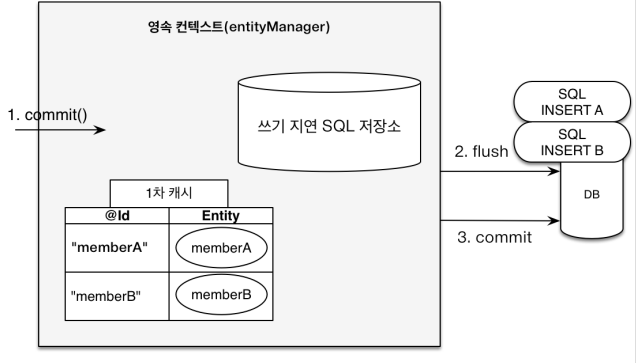

# 자바 ORM 표준 JPA프로그래밍

#### **이 페이지는 인프런의 자바 ORM 표준 JPA 프로그래밍 - 기본편 (김영한님)의 강의를 정리한 내용입니다.**

# 목차

-   [JPA 소개](#jpa)
-   [영속성 관리](#영속성-관리)
-   [엔티티 매핑](#엔티티-매핑)
-   [연관관계 매핑 기초](#연관관계-매핑-기초)
-   [다양한 연관관계 매핑](#다양한-연관관계-매핑)
-   [고급 매핑](#고급-매핑)
-   [프록시와 연관관계 정리](#프록시와-연관관계-정리)

# JPA

**Java Persistent API**

JPA는 Java Persistent API의 줄임말로써, 자바 진영에서 사용하는 ORM 기술의 표준을 의미한다.

**ORM?**

ORM은 Object-Relational Mapping의 약자로써, 객체 관계 매핑을 의미한다.
객체지향과 관계형 데이터베이스는 서로 추구하는 방향이 다르기 때문에 패러다임의 불일치가 발생한다. ORM을 이용하면 객체는 객체대로, DB는 DB대로 설계하고 ORM 프레임워크가 중간에서 이를 해결해 줄 수 있다.

**JPA는 애플리케이션과 JDBC사이에서 동작한다.**

자바에서는 데이터베이스를 추상화한 JDBC API가 존재한다. JPA는 JDBC API가 아닌 다른 무언가를 사용하는게 아니다. 단지 Java와 JDBC 사이에서 ORM의 역할을 맡은 하나의 기술이라고 생각해야한다.

**JPA는 표준 명세이다.**

JPA는 인터페이스의 모음이며, JPA자체로 실제 사용할 수 있는 기술이 아니다. JPA는 단지 "JPA는 이렇게 동작해야한다!" 라는 스펙이며 JPA를 이용하고싶다면 여러가지의 JPA 구현체중 한가지를 선택해서 사용해야한다.

JPA의 구현체는 Hibernate, EclipseLink, DataNucleus 등이 존재한다. 하지만 거의 Hibernate를 사용하는 편이다.

**JPA를 사용하면 좋은점?**

1. SQL중심적인 개발이 아닌, **객체지향 중심의 개발을 시도할 수 있다**. 기존 ORM이 없다면 패러다임의 불일치로 인해, 객체가 SQL에 의존적인 코드를 작성해야했지만, JPA를 이용하게되면서 그럴일이 많이 줄어들었다.
2. 시간이 곧 생산성으로 이어지는 개발자에게 테이블이 생길때마다 CRUD 쿼리와 코드를 작성하는 일은 지루하고, 생산성이 떨어진다. **JPA를 이용하면 JPA가 SQL의 쿼리를 직접 생성하기 때문에 개발자의 입장에서 생산성이 향상된다.**
3. 테이블의 명세가 바뀌면, 그에 따라 쿼리도 변경된다. JPA를 이용하면 이러한 면에서 유지보수가 굉장히 쉬워진다.
4. Layered Architecture에서는 다른 계층을 신뢰해서 사용해야하고, 다른 계층의 내부 구현을 신경쓸 필요가 없다. 하지만 **SQL중심적인 개발에서는 DB계층이 넘긴 객체의 그래프를 어디까지 탐색할 수 있을까에 대한 의문이 생긴다**. 즉 개발자는 DB계층에 대해 신뢰를 하기 힘들어진다. 하지만 JPA를 이용하면 객체 그래프 탐색이 어디까지 가능한가에 대한 의문을 하지 않아도 된다.

# 영속성 관리

### Persistence Context


**EntityManagerFactory**

EntityManagerFactory는 persistence 설정 정보를 통해서 생성된다. Persistence-Unit은 애플리케이션에서 접근하려고 하는 DB를 의미하며, DB와 통신하기 위해서는 EntityManagerFactory로 부터 EntityManager를 얻어야한다.

-   EntityManagerFactory의 생성비용은 굉장히 크다. 그렇기 때문에 애플리케이션 실행간 한번만 생성하며, 애플리케이션의 종료시 닫는다.
-   EntityManagerFactory는 Multi-Thread-Safe하다. 그렇기때문에 여러쓰레드에서 해당 객체를 참조하여, EntityManager를 생성한다.

**EntityManager**

EntityManager는 영속성 컨텍스트와 상호작용하기 위해 만들어졌다. 영속성 컨텍스트는 Entity 객체들의 집합이며, Entity 객체들의 LifeCycle을 관리한다.

이러한 영속성 컨텍스트에 Entity Instance들을 추가하고, 삭제하기 위해서 EntityManager라는것이 존재하며, EntityManager는 PK로 Entity를 찾거나, 쿼리를 보낼 수 있다.

**Persistence Context**

JPA에서 굉장히 중요한 용어로써, **Entity를 영구 저장하는 환경**이라는 뜻이다. 논리적인 개념이며, EntityManager를 통해서 영속성 컨텍스트에 접근할 수 있다. 영속성 컨텍스트는 Entity들의 생명주기를 관리하는데 상태는 아래와 같다.

-   비영속 ( new / traisent ) : 영속성 컨텍스트와 전혀 관련 없는 새로운 상태
-   영속 ( managed ) : 영속성 컨텍스트에 관리되는 상태
-   준영속 ( detached ) : 영속상태에서 분리된 상태 (관리되지 않음)
-   삭제 ( removed ) : 삭제된 상태


영속성 컨텍스트는 내부적으로 **1차캐시** 라는것을 가지고 있다. 1차 캐시는 쉽게 생각하면 자바의 Map<Id, Object>라고 생각하면 편하다.
Id는 각 Entity의 Primary Key를 의미하고, Object는 각 Entity이다.

EntityManager를 통해서 영속성 컨텍스트에 접근할 수 있다. 만약 EntityManager를 통해서 Entity를 찾고자 한다면, 일단 1차 캐시에서 Entity가 존재하는지 확인 뒤, 존재하지 않을때만 DB에 접근하게 된다. 그렇기 때문에 **EntityManager에서 얻은 동일한 PrimaryKey를 가진 Entity는 동일한 객체라는것을 보장할 수 있다.**


영속성 컨텍스트는 쓰기 SQL을 DB에 바로 보내는것이 아니라, 내부적으로 저장한뒤 flush() 메서드가 호출되면 DB에 일괄적으로 전송한다.


**Insert 쿼리를 쓰기 지연 저장소에 저장한다.**



**Commit() 메서드는 내부적으로 flush()메서드를 호출한다. 이후 버퍼링 되있던 INSERT쿼리가 전부 DB에 보내진다.**

영속성 컨텍스트는 영속상태의 Entity가 수정되면 이를 자동으로 감지하여, UPDATE 쿼리를 발생시킨다. 이를 **Dirty Checking**이라고 한다.

이러한 방법이 가능한 이유는 영속성 컨텍스트는 1차캐시에 Entity가 처음 저장될때 SNAPSHOT을 저장하기 때문이다.

이후 flush() 메서드가 호출되면
SNAPSHOT과, 현재의 Entity의 값들을 비교해서 차이가 존재하면, UPDATE 쿼리가 발생하게 되는것이다.


**Flush란?**

영속성 컨텍스트의 변경내용을 데이터베이스에 반영하는것이다. 이때 변경사항이란 Persist를 통해 새로 관리되는 Entity, Dirty Checking을 통해 변경된 Entity, 삭제된 Entity등을 의미한다.

flush()메서드는 DEFAULT로, Commit()메서드나 JPQL 쿼리를 실행하면 자동 호출되지만 EntityManager에서 flush()메서드를 직접호출할 수 도 있다.
EntityManager는 언제 Flush를 시도할것인지(FlushModeType.AUTO, FlushModeType.COMMIT) FlushModeType을 지원한다.

보통 자바에서 flush() 메서드는 Buffering된 무언가를 처리하고 비우는 메서드이다. 영속성 컨텍스트에서 flush()는 지금까지 저장된 변경사항들을 처리하고 비우는 역할이다. 이때 **1차캐시를 지우는것은 아니라는점을** 확실히 해야한다.

**준영속상태 Detached**

준영속상태는 영속상태에서 전이될 수 있는 상태이다. 영속 상태의 엔티티가 영속성 컨텍스트에서 분리된 상태 (Detached)를 의미하며 이말은 즉슨, 영속성 컨텍스트가 해당 Entity를 관리하지 않는다는 의미이다.

이 말은 1차캐시에 해당 Entity가 없다는말과 동일하며, 동일성 비교, Dirty Checking등의 영속성 컨텍스트가 지원하는 기능을 사용하지 못한다는 뜻이다.

준영속상태는 detach(Object o) 메서드를 호출함으로써 사용할 수 있다. 단 모든 1차 캐시를 비우고 싶다면 clear()메서드를 이용하라.

# 엔티티 매핑

**객체와 테이블 Mapping**

JPA를 사용하기 위해서는 객체를 테이블과 매핑할 필요가 있다. **@Entity** 어노테이션을 이용하면 해당 클래스는 JPA가 관리하는 클래스란 뜻이며, 이를 Entity라고 한다.
만약 JPA를 사용하고 싶다면 @Entity 어노테이션은 필수다. 반드시 사용하도록 하자.

JPA Spec상 Entity클래스는 기본생성자를 지원해야한다. 내부적으로 Reflection기술을 사용하는데 이때 기본생성자가 필요하기때문이다.

**@Table** 어노테이션은 클래스를 어떤 테이블에 Mapping할 것인지에 대한 값을 할당할 수 있다. 기본적으로 선언되어있지 않다면 클래스 이름과 똑같은 테이블에 할당하게 되지만,
테이블 이름과 클래스 이름이 불일치할 경우 해당 어노테이션을 사용해서 매핑할 테이블 이름을 설정할 수 있다.

또한 데이터베이스의 **유니크 제약조건 또는 인덱스**를 설정할 수 있다. 유니크 제약조건 같은 경우 **@Column** 에서도 지원하긴 하지만, 여기서는 단일 컬럼에 대한 제약조건만 설정할 수 있으며, 생성되는 제약조건의 이름도 알아보기 힘들기 때문에 가능하다면 **@Table** 어노테이션에서 Unique 제약조건을 설정해주는것이 좋다.

**데이터베이스 Schema 자동생성**

JPA는 테이블에 대한 명세를 전부 가질 수 있기 때문에 자신이 DDL을 생성해서 데이터베이스에 테이블을 자동 생성할 수 있다. 하지만 이런 자동 생성방식은 운영환경, 스테이징 환경, 테스트 환경에서 굉장히 위험하게 작용할 수 있다. 그렇기 때문에 이런 자동생성 기능은 최대한 개발 초기환경에서만 사용하도록 하자.

자동생성기능은 **hibernate.hbm2ddl.auto**를 통해 설정한다.

-   create : 기존 테이블 삭제 후 다시 생성 (DROP + CREATE)
-   create-drop : create와 같으나 App이 끝나는 시점에 테이블 DROP
-   update : Table의 변경분만 반영
-   validate : 엔티티와 테이블이 정상 매핑되었는지 확인. 정상적으로 매핑되어있지 않으면 에러발생!
-   none : 사용하지 않음

**DDL 생성 기능**

예를들면 **@Column(nullable = false, length = 10)** 이라는 어노테이션이 존재하면 NULL 제약조건은 FALSE이고, 길이는 10이하인 DDL을 생성한다. 하지만 생각해볼 수 있는점은 이 기능이 JPA의 실행로직에는 영향을 주지 않는다는것이다. 만약 테이블의 실제 제약조건이 명시한 제약조건과 다른 조건이라면 별 문제가 발생하지 않는다. 즉 DDL을 AUTO-CREATE을 하는 경우가 아니라면 DDL의 제약조건을 명시할 필요는 없지만, 그래도 개발자의 가독성을 위해서 명시적으로 선언해주는것이 좋은 방법일 것이다.

-   @Column : 컬럼 매핑

    name, insertable, updateable, nullable, unique, columnDefinition, length, precision, scale 존재

-   @Temporal : 날짜 타입 매핑 (LocalDate, LocalDateTime을 이용한다면 사용할 필요가 없다.)
-   @Enumerated : Enum타입 매핑 (EnumType.STRING을 항상 이용하자)
-   @Lob : BLOB, CLOB을 매핑한다. Binary 데이터의 경우 BLOB, 문자열 데이터의경우 CLOB으로 자동으로 매핑된다.
-   @Transient : 데이터베이스에 매핑하지 않을 컬럼을 명시할 수 있다.

**기본 키 매핑**

기본키는 데이터베이스에서 굉장히 중요하다. 기본 키를 이용해서 데이터를 고유적으로 식별할 수 있으며, 사실 PK가 존재하지 않는 데이터는 생각하기 힘들다.

기본키를 매핑하는 방법은 개발자가 직접 기본키를 매핑하거나, 데이터베이스에 위임하는 방식이 있다.

-   직접할당 : @Id 어노테이션만 이용한다. 이 어노테이션은 해당 필드가 PK라는 것을 명시한다. 모든 Entity는 @Id라는 어노테이션이 존재해야한다.
-   IDENTITY : @GeneratedValue(strategy=GenerationType.IDENTITY)

    기본 키 생성을 데이터베이스에 위임한다. 보통 Database에서 AUTO_INCREMENT를 생각하면 편리하다. IDENTITY방식을 이용하면 몇가지 주의할점이 존재한다.
    JPA는 내부적으로 1차캐시를 관리하고, 1차 캐시는 PK와 Entity로 이뤄져있다. 또한 JPA는 내부적으로 쓰기 SQL을 지연한다. 하지만 이때 IDENTITY방식으로 Entity를 저장하면,
    PK가 존재하지 않으므로 1차캐시에 데이터를 관리할 수 없다. 그렇기 때문에 IDENTITY방식의 PK 매핑 방식은 SQL쓰기지연을 하지 않는다. Insert Query가 발생하면 바로 데이터베이스에
    데이터를 삽입하게 된다.

-   SEQUENCE : @GeneratedValue(strategy=GenerationType.SEQUENCE)

    데이터베이스 시퀀스는 유일한 값을 순서대로 생성하는 특별한 데이터베이스의 오브젝트를 의미한다. 보통 Oracle DB에서 많이 사용한다. 데이터베이스 시퀀스는 데이터베이스에게 PK값을 요구하면 PK값을 응답받는 식으로 동작한다.
    Insert Query가 발생할때마다 데이터베이스 시퀀스에게 PK를 요청하는것은 사실 네트워크 자원을 낭비하는것과 다름이없다. 사실 이럴바에는 Insert 쿼리를 바로 날리는것이 낫다. 그렇기 때문에 데이터베이스 시퀀스는 PK값을 요청받으면 한번에 큰 폭의 PK값을 응답하게 된다. 그후 해당 메모리에서 이 PK값을 전부 사용할때까지는 데이터베이스 시퀀스에게 PK값을 요구하지 않게된다.

-   Table : @GeneratedValue(strategy = GenerationType.TABLE)

    테이블 전략은 키 생성 전용 테이블을 하나 만들어서 데이터베이스 시퀀스를 흉내내는 전략이다. 이 전략의 장점은 모든 데이터베이스가 이 전략을 사용할 수 있다는 점이지만, 단점으로는 SEQUENCE에 비해 성능이 떨어진다. 나머지는 SEQUENCE 전략과 거의 동일하다.

기본키는 사실 서비스가 운영되면서 유일해야하며 변하지 않아야한다. 이러한 조건을 만족하기 위해서는 **비지니스 로직과 상관없는 키**를 할당하는게 가장 쉽고 편하다. 권장되는 기본키는 Long형으로 선언하고 Key 생성전략을 사용하는것이다.

# 연관관계 매핑 기초

객체지향 연관관계와 데이터베이스 연관관계는 서로 패러다임이 다르다. 객체지향은 Reference를 통해 다른 객체와 연관되지만, 데이터베이스의 테이블은 다른 테이블의 PK를 FK로 설정함으로써, 연관된다. 이런 상황에서 객체를 테이블에 맞춰서 데이터 중심으로 모델링한다면 협력관계를 만들 수 없다.

**단방향 연관관계**

객체끼리 참조 관계가 있다면 회원 → 팀 또는 팀 → 회원 둘 중 한쪽만 참조하는것을 단방향 관계라고 하며, 회원 → 팀, 팀 → 회원 양쪽 모두 서로 참조하는것을 양방향 관계라고 한다.
방향은 객체 세계에서만 존재한다. 데이터베이스 세계에서는 FK를 이용하기 때문에 항상 양방향 관계이다.

여러명의 회원과 회원들이 속해있는 한가지의 팀이 있다면, 이는 다대일 관계이다. 객체는 일반적으로 아래와 같은 코드로 관계에 속해있는 객체를 가져올 수 있다.

```java
member.getTeam();
```

Member에서 Team을 조회할수 있지만 Team에서는 Member를 조회하지 못하는 것. 그것이 바로 단방향 관계이다.

하지만 데이터베이스 세계에서는 단방향 관계란 존재하지 않는다. 단지 FK를 알고만 있다면 어느쪽에서든 JOIN 연산을 통해 관계에 대한 데이터를 얻을 수 있다.

```sql
SELECT * FROM MEMBER M JOIN TEAM T ON M.TEAM_ID = T.TEAM_ID;
SELECT * FROM TEAM T JOIN MEMBER M ON T.TEAM_ID = M.TEAM_ID;
```

사실 객체에서 참조를 통한 연관관계는 항상 단방향이다. 객체간에 연관관계를 양방향으로 만든다는것은 단지 반대쪽에서도 단방향 관계를 만든다는 뜻으로, 서로 다른 단방향 관계가 2개가 있는것이다.

JPA는 위와같은 패러다임의 불일치를 해결하기 위해서 연관관계를 매핑할 수 있는 어노테이션들을 제공한다.

-   **@JoinColumn :** 조인 컬럼은 외래키를 매핑할때 사용된다. name 속성에 매핑할 외래키 이름을 지정한다.
-   **@OneToOne :** 1 : 1 관계를 매핑할때 이용된다.
-   **@ManyToOne :** N : 1 관계를 매핑할때 이용된다.
-   **@OneToMany :** 1 : N 관계를 매핑할때 이용된다.
-   **@ManyToMany :** N : N 관계를 매핑할때 이용된다.

Entity간의 연관관계를 잘 매핑했다면 Entity끼리 객체 그래프를 탐색하는것을 통해 데이터를 얻어올 수 있다.

```java
Member findMember = entityManager.find(Member.class, 1L); //PK가 1인 Member 데이터를 가져온다.
Team findTeam = findMember.getTeam(); //참조를 이용해서 연관관계의 데이터를 조회한다.
```

**양방향 연관관계**

객체에서의 양방향 연관관계는 서로 반대 방향의 단방향 관계가 2개 있는것이다. 데이터베이스 테이블의 경우 FK값을 통해서 조인연산을 수행할 수 있지만 객체는 참조를 통해서 가져온다.
양방향 연관관계는 단방향 연관관계와는 다르게 **연관관계의 주인 (Owner)**을 설정해줘야 한다.
일반적으로 데이터베이스는 N : 1 관계에서 N에 해당하는 테이블이 1에 해당하는 테이블의 PK를 FK로 가지게 된다. 객체는 서로간에 누가 이 FK 값을 관리할것인지 결정해야한다. 그래서 연관관계의 주인만이 외래 키를 관리 (등록, 수정) 하며 주인이 아닌 객체는 읽기만 가능하다.

연관관계의 주인을 설정하는 방법은 연관관계의 매핑을 도와주는 어노테이션에 **mappedBy** 라는 속성을 이용하는것이다. 연관관계 주인은 이 속성을 사용하지 않고, 주인이 아닌 객체는 mappedBy 속성으로 주인을 지정한다.

**누구를 주인으로?**

외래키가 있는곳을 주인으로 정하는것이 중요하다.

**양방향 매핑시 연관관계의 주인에 값을 입력해야 한다.**

만약 연관관계의 주인이 아닌곳에 값을 입력한다면 데이터베이스에 반영되지 않을것이다. 사실 객체지향을 따진다면 두 곳 모두 값을 입력하는게 옳다. 이는 연관관계 편의 메소드를 이용해서 구현하자. 예를들면 아래와 같다.

```java
public void changeTeam(Team team) {
	this.team = team;
	team.getMembers().add(this);
}
```

# 다양한 연관관계 매핑

Entity들간 연관관계를 매핑할 때는 다음과 같은 3가지를 고려해야한다.

1. **다중성**
    - 다대일 : @ManyToOne
    - 일대다 : @OneToMany
    - 일대일 : @OneToOne
    - 다대다 : @ManyToMany
2. **단방향, 양방향**
    - 테이블은 외래키만 있다면 양방향 관계가 성립된다. 테이블은 사실 방향이라는 개념이 없다.
    - 객체는 단뱡향 관계만 존재한다. 참조를 통해 접근하기 때문에 참조 필드쪽으로 관계가 성립된다. 객체에서 양방향 관계란 단방향 관계가 2개 존재하는것이다.
3. **연관관계의 주인**
    - 객체에서 양방향 관계를 성립하고 싶다면, Owner를 지정해야한다. 어떤 객체가 외래키를 수정할 책임이 있는지에 대해 설정해야한다. 하지만 왠만하면 외래키를 가지고 있는 객체가
      외래키를 수정하는것이 옳다. 주인이 아닌 객체는 외래키에 영향을 주지 못한다. 단순 조회만 가능하다.

### 다대일 단방향

가장 많이 사용하는 연관관계이다. @ManyToOne 어노테이션을 지정하고 @JoinColumn을 이용하여 어떤 값을 이용하여 조인할것인지 설정한다.

### 다대일 양방향

양방향 관계에서는 연관관계의 주인, Owner를 설정해야한다. 일반적으로 외래키가 있는 쪽이 연관관계의 주인으로 두는것이 옳다. 객체에서는 서로 객체간 접근할 수 있게 참조필드를 선언하고 사용한다.

### 일대다 단방향

일대다 단방향은 사실 좀 이상한 구조이다. 테이블의 외래키는 1: N 관계에서 N쪽에 생길 수 밖에 없다. 하지만 일대다 단방향을 설정하면 외래키가 N쪽에 존재함에도 불구하고 1쪽에서 외래키를 수정하게된다.


즉 위와 같은 그림에서 Team에 Member를 추가하게 되면 Member Table의 TEAM_ID가 변경되는것이다. 딱 봐도 무언가 이상하다. 분명히 Team을 수정했는데 바뀌는것이 Member이기 때문에 개발자에게 혼동을 줄 수 있다. 이런 연관관계는 가능한 사용하지 말자.

### 일대다 양방향

이런 매핑을 사실 공식 Spec으로는 존재하지 않지만 편법을 이용해서 구현할 수 있다. 연관관계의 주인이 아닌 쪽에서 @JoinColumn(insertable=false, updatable=false) 를 이용해서 읽기 전용 필드를 만들어버리는것이다. 위와같이 일대다 단방향보다 더 이상한 연관관계이다. 가능한 사용하지 말자.

### 일대일 관계

일대일 관계는 외래키가 존재할 곳을 선택할 수 있다. 주 테이블 또는 대상 테이블 어디에나 외래키가 존재할 수 있으며, 다대일 관계와의 차이점은 외래키가 UNIQUE라는 점이다. 이 뜻은 이 외래키가 하나만 존재한다는뜻으로 1:1 관계임을 뜻한다.


위의 구조는 MEMBER 라는 주 테이블이 외래키를 관리하는 연관관계이다. 강의에서는 이런 구조를 사용한 이유가 몇가지 존재한다.

1. MEMBER에서 LOCKER에 접근하기 쉬움

2. Lazy전략을 사용가능함. (만약 LOCKER가 MEMBER의 외래키를 가지고있다면 주로 작업하는 MEMBER에서 Lazy전략을 사용할 수 없다. (값이 있는지 없는지 확인 불가능))

    처음에 개인적인 생각으로는 LOCKER가 MEMBER_ID를 외래키로 관리하는것이 옳다고 생각했었다. 그 이유는 외래키가 NULL이 될 수 있다는 점과 이후에 요구사항이 늘어나면 MEMBER테이블이 자연스럽게 커지게 될것이며, MEMBER는 단지 순수한 MEMBER의 정보만 가지고 있어야된다고 생각했다. 하지만 강의를 듣고나서 뭔가 1 : 1 관계에서는 LazyLoading과 관련된 이야기를 듣고 정말 Trade-Off가 될 수 있는 지점이라는것을 알게 되었다.

1:1 관계는 어디에서 외래키를 관리할것인지 신중하게 생각해서 사용하자.

### 다대다 관계

RDB는 다대다 관계를 표현할 수 없다. 일반적으로 중간 테이블을 두고, 일대다, 다대일 관계로 풀어내야한다. 하지만 객체는 다대다 관계가 가능하다.
분명히 JPA가 제공하는 다대다 관계는 편리해보이지만, Entity사이에 존재하는 중간 테이블에는 여러가지 데이터가 추가될 수 있다. 이러한 이유로 인해 다대다 관계는 사용되지 않는다.


# 고급 매핑

## 상속관계 매핑

RDB는 객체지향처럼 상속관계는 존재하지 않지만, 슈퍼타입과 서브타입이 존재해서 서브타입이 슈퍼타입의 PK값을 FK로 가지는 모델링 기법이 객체 상속과 유사하다.

JPA는 RDB와 객체지향 패러다임의 차이를 극복하기 위해 상속관계 매핑 기능을 여러가지 전략(@Inheritance)으로 제공한다.

-   **@Inheritance(strategy = InheritanceType.JOINED)**

    조인전략으로써, 상위 타입과 하위 타입이 각각 테이블로 분리되어 상위타입의 PK를 하위 타입이 FK로 가지는 형태이다. 정규화된 테이블을 작성할 수 있고, 외래키 제약조건 설정, 저장공간을 효율적으로 저장할 수 있다.

    단 조회시 항상 Join연산을 필요로 하므로, 성능에 문제가 생길수 있고, INSERT 쿼리시에 상위 테이블, 하위 테이블에 각각의 INSERT 쿼리가 발생한다.

-   **@Inheritance(strategy = InheritanceType.SINGLE_TABLE)**

    상위 Entity와 이를 상속받는 하위 Entity들의 모든 Mapping 필드들을 한개의 테이블에서 관리하는 형태이다. 그렇기 때문에 조인연산이 필요하지 않다는것이 장점이다.
    하지만 필요없는 필드가 많아서 저장공간의 효율성이 떨어지고, 하위 Entity의 모든 Column들은 Nullable이여야한다.

    또한 이 레코드가 어느 Entity에 속하는지 알기위해 DTYPE을 항상 사용해야한다.

-   **@Inheritance(strategy = InheritanceType.TABLE_PER_CLASS)**

    하위 Entity마다 상위 Entity의 모든 Column을 복사하여, 독립적인 한개의 TABLE을 구성하는 방식이다. 그렇기 때문에 해당 전략에서는 DTYPE이 아예 사용되지 않는다. NOT NULL제약조건도 이용할 수 있으며, 타입을 확실하게 구분할 수 있지만, 상위 Entity를 이용하여 조회하고 싶다면 성능이 매우 느린 UNION SQL을 이용해야한다. 이 방식은 잘 추천되지 않는다.

상속관계간 상위타입의 테이블에서는 이 레코드가 누구의 레코드인지 판단하기 위해서 DTYPE이라는것을 이용한다. DTYPE은 현재 레코드가 무슨 타입인지 알려주는 역할을 한다.
JPA에서는 DTYPE을 명시적으로 선언할 수 있는 방법을 제공한다. **@DiscriminatorColumn, @DiscriminatorValue 와** 같은 어노테이션을 이용한다면 명시적으로 DTYPE을 선언할 수 있다.

## 공통 정보 매핑

### @MappedSuperclass

만약 상속관계가 아니라, 공통으로 매핑을 하고싶은 정보가 있다면 JPA에서는 해당 기능을 제공하기 위해 **@MappedSuperclass** 라는 어노테이션을 지원한다. 이 어노테이션을 이용하면 부모 클래스를 상속받는 자식 클래스에 매핑 정보만 제공한다. 그렇기 때문에 상위 클래스를 이용해 Persistence Context에서 조회 및 검색이 불가능하다. 코드를 아래와 같이 작성해서 사용할 수 있다.

```java
@MappedSuperclass
public abstract class BaseEntity {
	private String createdBy;
	private LocalDateTime createdAt;
	private String lastModifiedBy;
	private LocalDateTime lastModifiedAt;
}
```

이후 이 매핑 정보를 원하는 Entity는 BaseEntity를 상속받아서 이용하면 된다. 보통 이러한 클래스는 직접 생성해서 사용할 일이 없기 때문에 추상 클래스를 이용한다.

## **@Inheritance(strategy = InheritanceType.TABLE_PER_CLASS) vs @MappedSuperclass**

이 질문은 굉장히 개인적인 의문점으로, 사실 위의 두개의 코드를 통해 생성되는 테이블은 동일하다.

그러면 어떤상황에서 상속관계매핑을 이용하고 어떤 상황에서 공통정보매핑을 이용해야 할까? 그것은 바로 상위 타입이 Entity인가? 에 대한 근본적인 의문으로부터 시작된다.
상위타입이 Entity라는것은 PK를가지며, 특정 객체로부터 이 객체가 사용될 수 있다는 의미이다. 즉 비지니스 로직에 포함되는 객체이다. 이러한 Entity는 상속관계 매핑을 이용하는것이 옳다.

공통관계매핑에서도 PK의 생성전략이 동일하다면 공통 매핑이 가능하다. 하지만 이 객체는 비지니스 로직에 포함되지 않는다. 단지 매핑할 데이터 컬럼만 가지고 있을뿐이다.

위의 두가지를 잘 파악해서 상속관계 매핑을 이용할것인지 공통정보 매핑을 이용할것인지 결정해야한다. 결정 기준은 상위 타입의 객체가 Entity가 될 수 있는가?에 대한 의문점에 대한 답이다.

# 프록시와 연관관계 정리

### 프록시

IT쪽에서 보통 프록시라는 용어는 **대리자**라는 의미로 많이 사용되는것 같다. JPA에서도 프록시가 이용되는데, 보통 지연로딩을 하기 위해서 많이 이용된다.

JPA 프록시는 Entity클래스를 상속받아서 만들어지기 때문에 겉으로 보기에는 Entity와 똑같이 보이나 내용물은 텅 비어있는 형태이다. 하지만 이후에 프록시 객체를 사용하면, 실제 객체에게 메서드를 위임함으로써 동작하게 된다. 이렇게 프록시 객체를 사용했을때의 장점은 조회 쿼리를 최대한 늦출 수 있다는점이다. 동작과정은 아래와 같다.


프록시는 처음 사용될때 영속성 컨텍스트에게 초기화를 요청한다. 이후 영속성 컨텍스트는 실제 Entity를 DB로부터 데이터를 가져와 생성하고 프록시 객체에게 넘기게된다.

### 즉시로딩과 지연로딩

즉시로딩과 지연로딩은 연관관계 매핑에서 FetchType의 값을 통해 설정할 수 있다.

-   즉시로딩 (FetchType.EAGER)

    처음 Entity를 가져올때 관련된 Entity들을 JOIN 연산을 통해서 가져온다.

    즉시로딩은 JPQL에서 문제가 발생할 수 있다. 실제 개발자가 보낸 쿼리에 즉시로딩 할 연관된 Entity들을 쌓기 위해 또 다른 쿼리가 발생한다. 이때 각 쿼리가 N개 발생할 수 있는데 이를 N+1 문제라고 한다.
    @ManyToOne, @OneToOne은 Default가 즉시로딩이다. **가능하면, 지연로딩을 사용하자!
    만약 데이터를 JOIN으로 한번에 가져오고 싶다면 이후에 JPQL 또는 Entity Graph 기능을 이용하자.**

-   지연로딩 (FetchType.LAZY) :

    처음 Entity를 가져올때 관련된 Entity들은 Proxy객체로 대체하고, 이후에 사용될때 조회 쿼리를 날리게 된다.
    @OneToMany, @ManyToMany는 Default가 지연로딩이다.

### 영속성 전이 : CASCADE

특정 Entity가 영속성 컨텍스트에 의해 영향을 받을때 연관된 다른 Entity도 같이 영향을 받는다.

-   **CasCadeType.PERSIST** : Entity가 영속화될때 연관된 Entity들도 전부 영속화된다. 다만 바로 발생하는것이 아니라, flush() 메서드가 호출할때 발생한다.
-   **CasCadeType.REMOVE :** Entity가 삭제될때 연관된 Entity들도 전부 삭제된다. 다만 바로 발생하는것이 아니라, flush() 메서드가 호출할때 발생한다.
-   **CasCadeType.DETACH :** Entity가 준영속화될때 연관된 Entity들도 전부 준영속화된다.
-   **CasCadeType.ALL :** 위의 모든것을 전부 적용한다.

### 고아 객체

JPA는 부모 엔티티와 연관관계가 끊어진 자식 엔티티를 자동으로 삭제하는 기능을 가진다. 이를 Orphan (고아) 객체 제거라고 한다. 고아 객체 제거 기능을 이용하려면
orphanRemoval = true 설정해야한다. 이 기능을 사용했을때 부모 Entity에서 자식 Entity를 컬렉션에서 제거하면, DELETE 쿼리가 발생한다.

**고아객체는 반드시 참조하는곳이 하나일때 사용해야한다. 즉 약개체 또는 특정 엔티티가 대상 엔티티를 개인 소유할때 이용해야한다.**

고아 객체 기능을 이용하면 CasCadeType.REMOVE 처럼 동작할 수 있다. 부모 객체가 사라지면 자식 객체의 참조지점이 사라지기 때문이다. 하지만 CasCadeType.REMOVE 와 고아 객체는 확연히 다르다.

### 영속성 전이 + 고아 객체, 생명주기

**CascadeType.ALL + orphanRemoval = true**

이 뜻은 부모 Entity가 자식 Entity의 생명주기를 관리한다는 뜻이다. 보통 Entity의 생명주기는 Persistence Context 즉, 영속성 컨텍스트가 EntityManager의 API를 통해서 관리한다. 하지만 위와 같이 선언하면 부모 Entity에서 컬렉션에 자식 Entity를 추가하고 삭제하는것만으로도 기능이 작동한다. **이는 부모 Entity가 자식 Entity의 생명주기를 관리할 수 있다는 뜻이다.**
