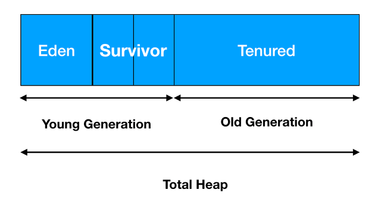

# Java Virtual Machine

**이 페이지는 김한도님의 Java Performance Fundamental 책을 읽고 정리한 내용입니다.**


# 자바란 무엇인가?

단순한 프로그래밍 언어로써가 아닌, 자바는 **Write Once, Run Anywhere** 라는 철학을 시작으로 발전된 개념이다.

**.java**

자바 소스코드는 보통 .java라는 확장자를 가진다. 이 파일은 단순히 코드를 담고 있는 파일일뿐, 이 자체로 프로그램 실행은 불가능하다. 이를 실행하기 위해서는 **javac** 라는 컴파일러가 필요하다. 
**컴파일** 이라는 작업을 통해 파일명은 같지만 확장자는 **.class** 인 파일을 가지게 된다.

**.class**

이 확장자를 가지는 파일은 수행이 가능한 형태의 파일이다. 그러나, 단독으로 수행할 수 있다는 의미는 아니다. 이것이 수행을 하기 위해서는 적어도 **JRE(Java Runtime Environment) 또는 JDK (JRE를 내장함)**가 필요하다.

위 프로그램을 실행하기 위해서는 java라는 프로그램을 호출하여, 우리가 생성한 .class파일을 인수로 주면 된다.
위의 과정중 Source파일로 Class파일을 생성하는 시점을 **Compile Time**이라고 한다. 그리고 컴파일을 거쳐, 생성된 .class 파일을 java 프로그램으로 실행하는 시점을 **Runtime** 이라고 한다.

Java라는 많은 Software기술이 적용되어 있다. 그중 하나가 객체지향이다. 그 밖에도 Multi-Threading, 구조화된 에러 핸들링, Garbage Collection, Dynamic Linking, Dynamic Extension 등이 있다.


## Linking

- **Linking이란?**

    Linking이란 **여러 개의 코드와 데이터를 모아서 연결**하는 작업이다. 우리가 소스 파일을 작성할 때 한 파일에 모든 프로그램을 작성하는 경우는 거의 없다. 실행가능한 파일(.exe) 을 만들기 위해서 소스파일들을 한개의 파일로 모으는 과정이 필요하다. 

    한개로 모여진 파일은 이제 실행될 수 있는 파일이며, 그 파일을 Loader를 통해, 프로그램 내부에서 사용하던 상대적인 주소에서 실제 메모리에 적재 가능한 절대 주소로 바뀌게 된다. 이것을 로더에서 **Relocation(재배치)** 라고 한다.

Linking방법에는 **정적 링킹과 동적 링킹**이 존재한다.

**정적 링킹**이란 실행 가능한 목적 파일을 만들때 프로그램에서 사용한 모든 라이브러리 모듈을 복사하는 방식이며, 링커에 의해 수행된다.

- 메모리에서 코드가 중복되기 때문에 비효율적이다.
- 프로그램 크기가 커진다
- 사용하고 있던 라이브러리가 변경되면 다시 컴파일하고 링킹해야한다.
- 하지만 빠르다.

동적 링킹이란 실행 가능한 파일을 만들 때 프로그램에서 사용하는 모든 라이브러리 모듈을 복사하지 않고, 해당 모듈의 주소만가지고있다가, 런타임에 실행 파일과 라이브러리가 메모리에 위치될 때 해당 모듈의 주소로 가서 필요한 것을 들고 오는 방식이다. **동적 라이브러리를 DLL**이라고 부른다.

- 동적라이브러리는 프로그램이 실행될때 링크된다. (이미 실행되어있는 경우에는 로드 하지않음)
- 라이브러리를 프로그램이 공유해서 사용하기 때문에 메모리를 절약할 수 있다.

하지만 동적 링킹은 **불일치(Compatibility)**에 대한 문제가 발생할 수 있다. (라이브러리가 메모리에 있는줄 알았는데 없는 경우)


다시 Java로 돌아와서, Java는 **Dynamic Linking**을 사용한다. 이것이 가능한 이유는 .class파일이 실행 가능한 형태가 아닌, 단지 JVM이 읽을 수 있는 형태의 Java Byte Code 이기 때문이다. 
Java Byte Code는 JVM위에서 실행가능한 형태로 변형되며, 이 과정에서 Linking 과정이 수행되고, .class파일은 JVM위에서 Linking 작업을 수행할 수 있도록, 라이브러리에 대한 Symbolic Reference만을 가지고 있게 된다.

또한 Java가 생산성을 가질 수 있던것은 **Runtime Memory**를 개발자가 직접 핸들링하지 않기 때문이다. 개발자는 Java를 통해서 메모리를 핸들링 해서는 안되고, 할 수 있는 방법도 존재하지 않는다.


## **Java Application Interface**

앞서서 자바 프로그램 ( .class ) 파일이 실행되기 위해서는, JRE가 필요하다고 했었다. JRE는 말 그대로 자바 실행 환경으로, 여기에 Java Virutal Machine, Java API, Native Method가 포함된다.


만약 자바에서 File객체에 접근하여 파일 정보를 가져온다고 가정하자. 그렇다면 이때 File클래스는 Java API라고 할 수 있다. 그리고 파일 정보를 가져올때 Native Method를 통하여, OS에 명령을 전달하게 되고, 이후 OS가 실제 File IO를 일으키고, 결과를 Native Method에 전달, Java API로 전달 받는 과정이다. 참고로 Native Method는 C, C++, Assembly 로 작성되어 있다.


# **JVM이란?**

JVM은 하나의 개념이자 스펙에 지나지 않는다. 실제로 그렇게 되어있고 JVM은 그 누구도 자세한 설계도를 만들어 제공하지 않는다. 단지 JVM은 이렇게 저렇게 해야 한다는 식의 정의만 되어있다.

JVM의 표준화된 정의가 나오면 각 JVM 벤더들은 이에 맞도록 자신들의 JVM을 구현한다. 그렇기 때문에 지구상 어디에도 정통 JVM이란 존재하지 않는다.

즉, JVM은 정의된 명세를 구현한 하나의 독자적인 Runtime이라고 할 수 있다. 이 말은 JVM은 하나의 프로세스 형태로 구동한다는 의미도 내포한다.


## **Runtime Data Areas**

JVM이 프로그램을 수행하기 위해 OS로부터 할당 받는 메모리 영역이라고 정의 내릴 수 있다. JVM에서 .class파일의 실행은 Class Loader를 통해 로딩되면서 시작된다. 

보통 메모리 누수나 Garbage Collection에 관한 문제는 Runtime Data Areas에서 발생하는 문제이다. 그렇기 때문에 Runtime Data Areas에 대한 이해는 중요하다.


## **5가지의 메모리 영역**


각각의 목적에 따라 5개의 영역으로 나뉜다.

- **PC Registers  - Thread별로 생성**
- **JVM Stacks - Thread별로 생성**
- **Native Method Stacks - Thread 별로 생성**
- **Method Area - Thread 공유**
- **Heap - Thread 공유**

위의 3가지는 각 Thread 마다 생성이 되는 메모리 영역이고, Method Area와 Heap 영역은 모든 쓰레드가 공유하여 사용한다.


## **PC Registers**

CPU에는 레지스터들이 존재한다. 레지스터들은 연산이 수행되는 동안 필요한 정보를 저장하는데 사용한다. 보통 하나의 CPU에는 기억 레지스터, 주소 레지스터, 명령 레지스터, 연산 레지스터 등 수십개의 레지스터를 가지고 있다.

JVM의 **PC Registers영역은 위에서 말하는 레지스터와는 다른개념이다.** JVM은 CPU에 직접 Instruction을 수행하지 않으며, Stack에서 Operend를 뽑아내어 이를 별도의 메모리 공간에 저장하는 방식을 취한다.

JVM또한 프로세스이고, 현재 작업하는 내용을 CPU에 Instruction으로 당연히 제공해야한다. 이를 위한 버퍼 공간으로써 PC Registers라는 메모리 영역을 생성한 것이다. Thread가 Java Method를 실행하고 있으면, PC Registers에는 현재 수행 중인 JVM Instruction의 주소를 가지게 된다. 만약 C언어 등으로 Native Method를 실행한다면 PC Registers는 undefined 상태이다.


## Java Virutal Machine Stacks

Thread의 수행 정보를 기록하는 메모리 영역이다. 그렇기 때문에 Thread마다 한개씩 존재하며, 모든 데이터는 각 Thread가 소유하며 다른 Thread는 접근이 불가능하다.

Java Virtual Machine Stacks는 Stack Frame들로 구성이되는데, JVM은 Stack Frame을 단지 넣고 빼는 작업만 수행한다.

보통 자바 어플리케이션에 문제가 생기면 `kill -3 pid` 로써 Stack Trace 를 얻어낸다. 이때 출력되는 정보가 Stack Frame의 정보이다.

보통 메서드가 하나 수행되면 Stack Frame이 하나 생기고, 메서드가 종료되면 Stack Frame이 하나 제거된다.


### Stack Frame

Thread가 수행하고 있는 Application을 Method 단위로 기록한다. Stack Frame은 Local Variable Section, Operend Stack, Frame Data 총 3부분으로 구성되어 있다. Stack Frame을 실행하게 되면 Class의 메타 정보를 이용하여 적절한 크기로 생성되며, Stack 크기는 가변이 아니며 Compile Time에 결정된다. 그럴 수 있는 이유가 Method 내에서 사용하는 변수나 연산에 관련된 내용, 그리고 반환 값Type등은 이미 소스코드 내에서 결정되어있기 때문이다. JVM은 생성된 StackFrame을 Java Virutal Machine Stacks에 Push 하고, Method를 수행한다.

- **Local Variable Section**

    Method의 Parameters와 Local Variable들을 저장한다. 이 Section은 0부터 시작하는 인덱스를 가진 Array로 구성되어 있고, Array의 인덱스를 통해 데이터에 접근하게 된다. Method Parameters같은 경우에는 순서대로 인덱스가 할당되며, 로컬 변수는 Compiler가 알아서 인덱스를 할당한다. 만약 선언하고 사용하지 않는다면, 인덱스를 할당하지 않을 수도 있다.

    만약 Object나, Array, String과 같은 객체는 그 크기가 정해져 있지 않은 가변크기인데 어떻게 Compile Time에 Stack Frame의 크기를 결정할 수 있을까?

    그것이 바로 원시타입과 참조타입의 차이이다. 참조타입은 Object 또는 String과 같은 타입으로 Stack에 저장되는것이 아니라, **Reference 타입**으로 공간을 할당 받는다.

    Java의 모든 객체는 Reference로 넘겨받으며, 실질적으로 저장되는 공간은  Heap이다. 다시 말해 Stack에 객체를 직접적으로 저장하지 않고, 해당 객체가 존재하고 있는 Heap의 위치를 말해주는 Reference를 Stack에 저장하는것이다.

    **Integer vs int** 

    여기서 알 수 있는점은 자바에서 Integer 타입과 int타입중 어떤것이 성능면에서 유리하냐고 물어본다면 당연히 원시타입인 int타입 이다. Reference를 통해 객체를 찾아다니는것은 CPU연산을 필요로 한다. 그렇기때문에 성능상의 효율로 int타입이 더 많은 이점을 챙겨갈 수 있다.

    **Local Variable Section의 0번 인덱스?**

    모든 Instance의 Method에는 선언한적이 없는 한가지의 Reference 타입이 생성된다. 그것은 바로 **this**이다. this를 통해서 Instance에 접근할 수 있다. 단 static으로 선언한 Method의 경우에는 이것이 존재하지 않는다.

- **Operand Stack**

    JVM의 작업공간이라고 할 수 있다. 프로그램 연산을 수행하면서 필요한 데이터 및 결과를 해당 Stack에 저장한다.

- **Frame Data**

    이곳에는 Constant Pool Resoultion정보와 Method가 정상 종료되었을때의 정보, 비정상 종료했을때 Exception 관련 정보가 포함되어 있다.

    - Constant Pool Resoultion ⇒ Constant Pool의 Pointer 정보

    Constant Pool은 Method Area에 있는곳으로 Class의 모든 Symbolic Reference가 저장되어 있다.

    Method가 종료되면 Stack Frame은 POP되어 사라지고, 바로 이전에 호출한 Method가 Current Frame이 된다. 이때 Frame Data에서 이전에 호출했던 Method에 대한 Instruction Pointer가 들어가 있고 이 정보를 PC Register에 설정하고 Stack Frame을 POP하게 된다.

    Exception의 경우 발생하면 Frame Data에서 Reference로 가지고 있던 Exception정보를 가지고, 해당 하는 Byte Code로 점프하여 실행하게 된다.


## Native Method Stack

Native Code로 되어있는 Function의 호출을 하면, Java Virtual Stack은 남겨두고, Native Method Stack에 새로운 Stack Frame을 생성하여, 여기서 Function을 실행한다.


## Method Area

이 메모리 영역은 모든 Thread들이 공유하는 메모리 영역이다. 이 영역은 ByteCode 또는 Load된 Type을 저장하는 논리적 메모리 공간으로 정의할 수 있으며, Type이란 Class 또는 Interface를 의미한다.

저장되는 정보는 Type의 ByteCode뿐만 아니라, 모든 변수, 상수, Reference, Method Data등이 포함되며, Class Variable, 생성자의 정보도 포함된다. 이 정보들은 ClassLoader에게 넘겨 받은 Class File에서 Type 관련 정보를 추출하여 저장하게 된다.

즉 타입이 저장되는곳으로 다음과 같은 정보들이 저장됨

- FQCN (Full Qualified Class Name)
- Type의 직계 Super Class의 이름
- Type이 Interface인지 Class인지
- public, abstractm final 등 Type의 Modifier
- 등등

- **Constant Pool**

    JVM에서 가장 중요한 역할을 수행하는 곳이고 그만큼 많이 사용되는 공간. Type의 모든 Constant 정보를 가지고 있는 곳이다. 이때 Constant가 상수만을 의미하는것이 아니라, Literal Constant, Type Field(Local Varaible, Class Variable), Method로의 모든 Symbolic Reference까지 확장된 개념

    자바에서 어떤 객체를 참조할때 Memory Address를 언급하는것이 아니라, 객체의 이름으로 참조한다. 이렇게 객체의 이름으로 참조하는것이 Symbolic Reference이다. 이것이 Constant Pool에 저장된다 객체에 접근할 필요가 있으면 Constant Pool에서 Symbolic Reference를 통해 해당 객체의 Memory Address를 찾아 동적으로 연결한다.

- **Field Information**

    Field의 이름, Data Type, 선언된 순서, Field의 Modifier

- **Method Information**

    Method의 이름, Method 반환값, 인자의 Data Type, 선언된 순서 등등

- **Class Variable**

    static으로 선언된 변수이며, Class에서 하나의 값으로 유지된다.

- **Reference to Class ClassLoader**

    Type이 JVM에 Load될때 어떠한 ClassLoader를 경유하여 Loading 되었는지 추적한다. 이 이유는 한 Type이 다른 Type을 참조할 때 같은 ClassLoader를 사용하도록 되어있기 때문이다.

- **Reference to Class class**

    Type이 JVM에 Load되면, 항상 Reflection 객체가 하나 생성된다. 그래서 Method Area에는 Type 정보의 일부로 이 Instance의 Reference를 저장하고 있다.


## Java Heap

Java의 문제가 Memory 이슈에 집중이 되어왔기 때문에 이는 Java의 자동 Memory해제, 즉 Garbage Collection과도 연관이 깊다.

Java Heap은 모든 Thread들에 대해 공유된다. 그렇기 때문에 동일한 Instance를 공유하는 경우 동기화 문제가 수반되게 된다.

JVM은 Java Heap에 Memory를 할당하는 Instruction만 존재하고 ( **new** ), 메모리 해제를 위한 어떤 Java Code나 ByteCode가 존재하지 않는다. Java Heap의 메모리 해제는 오로지 Garbage Collection만 담당한다.

대표적인 Oracle HotSpot JVM Heap의 구조



- **Young Generation :** Object가 최초로 할당 되는 장소이며 Eden이 꽉 차게 되면 Eden의 모든 객체들의 참조 여부를 따져서 참조가 되어있는 Object이면 Survivor영역으로 옮기고, 참조가 없는 Object라면, 그냥 남겨 놓는다. 이후에 Eden 영역을 모두 청소해버린다.
- **Old Generation :** Young Generation영역에서 Live Object로 오랫동안 살아남아 성숙한 Object는 Old Generation영역으로 이동하게 된다. 이를 Promotion이라고 한다. 비교적 오랫동안 참조가되어 앞으로도 계속 이용될 확률이 높은 Object를 저장하는 공간이다.

**Object Layout (Hotspot JVM)**

Mark Word : Garbage Collector와 Synchronization 작업을 위해 사용함.
Class Address : Method Area에 있는 클래스 정보에 대한 포인터
Array Size : 배열의 크기


**Runtime Data Areas Simulation**

Java에는 4가지의 변수 유형이 있다.

- 클래스 변수
- 멤버 변수
- 파라미터 변수
- 로컬 변수

클래스 변수같은 경우 이름에 걸맞게 Class에 속해있는 변수이다. 그렇기 때문에 이 변수는 Method Area의 Class Variable 영역에 할당 받는다.

멤버 변수같은 경우 Instance안에 속해있다. 그렇기 때문에 Heap에 저장된다.

파라미터 변수의 경우 Stack에 할당받는다.

로컬 변수의 경우 Stack에 할당받는다.

```java
Class A {
   int i = 2;                      // Heap에 할당, Value 타입
   Integer j = new Integer(3);     // Heap에 j, object저장, 
															     // j는 Reference 타입이며 new Integer(3)을 가르킴
   public void static main(){
       int a = 2;                  //Stack에 할당, Value 타입
       Integer b = new Integer(3); // Stack에 b를 저장 Heap에 Object를 저장
																	 // b는 Reference타입이며Heap에 있는 Object를 가르킴
   } 
}
```


# Garbage Collection

Java의 메모리 할당은 개발자가 원하는 만큼 할 수 있지만, 이미 할당 받은 메모리를 해제하는것은 개발자의 영역이 아니다. 하고싶어도 할 수 없다.

여기서 말하는 메모리의 해제란 **Heap**이나 **Method Area**에 있는 특정한 Object를 Memory 에서 삭제한다는 의미로 생각해야한다.

Java의 메모리 해제는 **Garbage Collector가 Garbage Collection**을 통해 메모리를 해제한다. JVM은 하나의 스펙이고, 각 벤더들은 다음과 같은 스펙으로 Garbage Collector를 구현했다.

> Heap 영역은 Object를 위한 공간이며, Garbage Collector라고 하는 자동화된 시스템에 의해 Heap은 전부 재사용 될 수 있다. Object는 절대로 명시적으로 해제되지 않는다.

각 JVM의 각 벤더에서는 여러가지 GC를 제공하며, 어떤 GC를 선택하느냐에 따라 성능에 중요한 영향을 미치기도 한다. 

우리는 Garbage란 무엇이며, Garbage Collection은 어떠한 방식으로 동작하는지 알아야 한다.


## Garbage란?

Garbage Collection이란 말 그대로 Garbage를 모으는 작업이다. 여기서 **Garbage란 Heap과 Method Area 에서 사용되지 않는 Object**를 의미한다.

여기서 문제점은 사용되지 않는 Object를 어떻게 판별할것인가에 대해서다.

현재 사용 여부는 **Root Set** 과의 관계로 표현한다. 만약 Root Set에서 어떤 식으로든 Reference관계가 있다면 **Reachable Object**라고 한다. 이것을 현재 사용하고 있는 Object로 간주한다.

### Root Set

Root Set은 3가지로 구분된다.

1. **Stack의 참조 정보.**

    Local Variable Section과, Operend Stack에 Object의 Reference 정보가 있다면 이것은 Reachable Object이다.

2. **JVM Method Area의 Constant Pool에서 참조** (정적 변수에 의한 참조)
3. **Native Method로 넘겨진 Object의 Reference**

이 3가지 Reference정보에 의해 직, 간접적으로 참조되고  있다면 모두 Reachable Object이고, 그렇지 않은것은 모두 Garbage Object이다.


Garbage Collection은 보통 메모리의 압박이 있을때 수행하게 된다. 어떤 이유에서든지 메모리가 필요하면 수행한다는 뜻이다. Garbage Collection은 새로운 Object의 할당을 위해 한정된 Heap공간을 재활용하려는 목적으로 수행되는것이다.

재활용을 위해 수행된 메모리의 해지는 할당한 그 자리에서 이루어지기 때문에 Garbage가 빠져나간 자리는 듬성듬성할 수밖에없다. 즉 단편화가 발생하는데 이것을 Heap 의 단편화라고 한다.


이러현 현상을 방지하기위해 GC는 Compaction Algorithm을 사용한다.

**결국 GC란 Heap을 재활용하기 위해 Root Set에서 참조되지 않는 Object를 없애 가용한 공간을 만드는 작업이라고 할 수 있다.**


# Garbage Collection Algorithm

GC는 자바의 전유물이 아니며, 현재 많은 스크립트 언어, .NET에서도 GC를 사용한다. 그렇다고 해서 각 회사가 GC Algorithm을 배타적으로 연구하여 적용해온것은 아니고 이미 GC가 존재하기 이전부터 알고리즘은 존재했고, 이것을 GC에 가져다 사용한것 뿐이다. 하지만 JVM이 발전할수록 GC도 발전하기 때문에 그에 맞도록 알고리즘을 점차적으로 개선한것도 사실이다.

GC의 Algorithm을 이해하기 위해서는 기본적으로 존재했었던 Algorithm에 대한 이해가 필요하다.

GC에서 사용하는 기본적인 알고리즘

- Reference Counting Algorithm
- Mark and Sweep Algorithm
- Mark and Compacting Algorithm
- Copying Algorithm
- Generational Algorithm
- Train Algorithm


## Reference Counting Algorithm

GC알고리즘은 보통 Garbage Object를 찾아내는 부분 ( Detection )과 Garbage Object를 제거해야 하는 부분으로 나눌 수 있다.

이때 Reference Counting Algorithm은 Detection에 관한 부분으로 기본 아이디어는 각 Object마다 Reference Count를 관리하여 Object가 참조되면 Count를 1증가시키고 참조가 사라지면 1을 감소하는 식으로 동작한다. 이때 Reference가 직접적인 참조가 아니라 간접적인 참조라고 하더라도 모든 Object에 대해 연쇄적으로 Reference Count가 변경된다.

Reference Count가 0이되면 Garbage Collection이 발생하여 해당 Object를 제거한다. 이 알고리즘은 Garbage Object를 확인하는 방법이 매우 간단하고, Reference Count가 0이 될때마다 GC가 발생하기 때문에 자연스럽게 Pause Time이 분산되어 실시간 작업에도 거의 영향을 주지 않는다. 그러나 참조의 변경이 있을때마다 Count를 변경해줘야 하기 때문에 관리비용이 상당하다.

```java
Object a = new TwoInteger(new Integer(1), new Integer(2));
```


코드가 실행되었을때 힙 메모리 영역은 다음과 같이 할당된다. 이제 다음 코드를 보자.

```java
a = null;
```


위 그림과 같이 되고, TwoInteger는 Garbage Collection의 대상이 된다.


또한 연쇄적으로  Integer들도 Garbage Collection의 대상이 된다.


하지만 이 알고리즘의 문제는 메모리 누수의 가능성이 너무 높다. 다음 그림과 같은 Linked List가 있다고 생각했을때 메모리 누수가 발생한다.


Reference Count는 0이 아니여서 Garbage Collection의 대상은 아니지만, 분명히 Unreachable Object이다.


## Mark and Sweep Algorithm

Tracing Algorithm이라고도 불리는 해당 알고리즘은 이전의 Reference Counting Algorithm의 단점을 극복하기 위해 나왔다고 볼 수 있다. 이 알고리즘은 참조에 따라 Count를 하는 방식 대신 Root Set에서 시작하는 Reference의 관계를 추적하는 방식을 사용한다. 주로 GC의 Detection Algorithm은 이 방식을 이용한다.

이 알고리즘은 이름처럼 Mark Phase와 Sweep Phase로 나뉘어 진다.

**Mark Phase**

Garbage Object를 구별해 내는 단계로 Root Set에서 Reference관계가 있는 Object에 Marking 하는 방식으로 수행된다. 주로 Object Header에 Flag나 별도의 Bitmap Table을 사용한다.

**Sweep Phase**

Mark Phase가 끝나면 바로 Sweep Phase로 돌입한다. 이 단계는 Marking 정보를 활용하여 Marking이 되지 않은 Object를 지우는 작업이다. Sweep 이후 모든 Object의 Marking 정보를 초기화한다.


(a)는 Mark Phase 돌입 전이다. 아직 Marking되지 않았다.

(b)는 Marking된 이후 상태이다. Root Set부터 시작하여 참조하고 있는 모든 Object는 Marking 된다.

(c)는 Sweep Phase 이후 상태이다. Marking되지 않은 Object가 청소되었고, Marking정보가 초기화 되었다.

이 방법은 Reference관계가 정확히 파악되지만, 문제점이 몇가지 존재한다.

1. GC동작중에 Heap 사용이 제한된다.
2. Framentation (단편화) 가 발생한다.


## Mark and Compaction Algorithm

이 알고리즘은 Fragmentation (단편화)를 보완하기 위해 생긴 알고리즘이다. Sweep 대신 Compaction이라는 과정을 진행한다.

이 알고리즘은 **Mark Phase와 Compaction Phase**로 나뉜다.

**Compaction Phase**

Live Object를 연속된 메모리 공간에 차곡차곡 적재하는것을 의미한다.
Compaction을 하는 방식도 3가지가 존재한다. **Arbitrary, Linear, Sliding**

Arbitrary는 순서가 보장되지 않는 방식이다. Compaction이 무작위로 진행된다.
Linear는 Reference의 순서대로 Compaction된다. 아래 그림에서 1→2→3→4로 참조하고 있는게 아니라 1→3→4→2 순서대로 참조하고 있는 그림인데 그림이 이상하다.
Sliding은 할당된 순서로 정렬하는 방식이다. 보통 Heap은 하위 Address부터 할당을 시작하기 때문에 할당 순서는 Address순서가 되는 경우가 많다.


이중에서 가장 좋은 방식은 Sliding 방식이다. 얼핏 보면 Linear방식이 좋을듯 하지만 Compaction을 하는데 Reference의 순서를 따져야 하기 때문에 Overhead가 발생하고, Object탐색은 메모리 탐색이기 때문에 Random Access를 수행하기 때문에 인접해 있다고 해서 큰 장점이 되지는 않는다.


Mark and Compaction Algorithm은 단편화의 방지에 초점이 맞춰져 있기 때문에 메모리의 효율성이 가장 큰 장점이 된다. **하지만 Compaction 자체가 Overhead가 수반되는 작업이다.**


## Copying Algorithm

단편화의 문제를 해결하기 위해 제시된 또 다른 방법은 Copying Algorithm이다. 이 알고리즘은 Heap 영역을 Active 영역과 Inactive영역으로 나누어 사용한다. 이중 Active영역에만 Object를 할당 받을 수 있고, Active 영역이 꽉 차게 되어 더 이상 Allocation이 불가능하게 되면 Garbage Collection 이 수행된다.

Garbage Collection이 수행되면 프로그램은 일단 일시정지가 되고, Live Object를 Inactive 영역으로 Copy 하는 작업을 수행한다.

Copy 작업이 끝나면 Active영역에는 Garbage Object만 남아있게 되고 Inactive영역에는 Live Object만 있게 된다. 그런데 Inactive로 Live Object를 옮기면서 차곡차곡 적재를 하기 때문에 마치 Compaction을 한것과 같은 상태가 된다. 이후 Active영역은 모두 Free Memory가 되고, Active 영역과 Inactive 영역이 뒤바뀐다. 이를 **Scavenge**라고 한다.


## Generational Algorithm

GC에서 시간이 지나면서 몇가지 경험적 지식이 체득되었다. 대부분의 프로그램에서 생성되는 대다수의 Object는 생성된지 얼마 되지 않아 Garbage가 되는 짧은 수명을 가진다는 것이다. 하지만 모든 Object가 그런것은 아니고 어떤 프로그램이라 하더라도 수명이 긴 몇개의 Object는 반드시 가지고 있다는 사실도 알게 되었다. 이러한 Long Live Object의 경우 Inactive와 Active를 계속 왔다 갔다 하면서 Copy작업을 해야하는데 이 Overhead를 줄이기 위해 생겨난 알고리즘이 Generational Algorithm이다.

Generation Algorithm은 힙을 Age별로 Sub Heap으로 나눈다. Object는 맨 처음에 Young Generation이라는 곳에 할당되고 그곳에서 성숙하게 되면 Old Generation까지 Promotion하는 방식으로 동작한다. Age가 임계값을 넘어 다음 Generation으로 Copy 되는것을 Promotion이라고 한다.

Generational Algorithm은 현재 GC에서 가장 많이 사용되는 알고리즘으로 JVM에서는 GC의 기반 기술이 되어있다.


## Train Algorithm

Garbage Collection 동안에는 프로그램이 일시 중지되게 된다. 이것은 웹 응용 프로그램(WAS)와 같이 짧은 트랜잭션을 처리하는 시스템의 경우 불규칙적인 Suspend현상은 비지니스에도 악영향을 끼치게 된다.

Train Algorithm의 기본 아이디어는 Heap을 작은 Memory Block으로 나누어 이 Block 단위로, Mark Phase와 Copy Phase로 구성된 Garbage Collection을 수행하는것이다. 

기본단위가 Heap이 아닌 Block인 만큼 전체 Heap의 Suspend가 아닌 Collection중인 Memory Block만 Suspend가 발생한다. 즉 Suspend를 분산시켜 전체적인 Pause Time을 줄이는 아이디어이다.


# Garbage Collection of HotSpot JVM

HotSpot JVM GC의 가장 큰 특징은 Generational Algorithm을 사용한다는 것이다. 

Heap을 크게 2가지 영역(Young Generation, Old Generation)으로 나눈다. 


Young Generation은 Object를 Allocation하는 영역이다. 이후에 GC가 작동할때 살아남은 Live Object는 Survivor 영역으로 Copy된다. 이 영역은 Old Generation으로 가기 위한 대기장소라고도 볼 수 있으며, 이후에 Young Generation에서 오래동안 살아남아 성숙한 객체들은 Old Generation으로 들어가게 된다. 이를 Promotion이라고 한다.

HotSpot JVM은 각 Generation별로 Garbage Collection을 수행한다. 여기서 Young Generation은 빈번하게 Garbage Collection이 발생한다. 일단 할당할 수 있는 메모리에 압박이 생기면 Young Generation에 GC를 동작하는데 이때 동작하는 GC를 **Minor GC**라고 한다.

Minor GC의 결과 충분히 성숙된 Object는 Promotion이 발생하여 Old Generation으로 Copy된다.
이때 Old Generation의 메모리가 충분하지 않을경우 GC가 발생한다. 이때 동작하는 GC를 **Full GC (Major GC)**라고 한다.


# Garbage Collector의 종류

- **Serial Collector**

    HotSpot JVM의 가장 기본적인 Collector이다.

    Young Generation : Generational Algorithm 사용
    Old Generation : Mark-and-Compacting Algorithm 사용

    IT환경이 발전할수록 Heap의 크기가 커져서 GC 수행중에 Suspend 현상이 더욱 드러나기 시작했는데, Application은 실시간에 가까운 성능을 요구하고 있었다.

- **Parallel Collector**

    Young Generation : Parallel Copy Algorithm사용
    Old Generation : Mark-and-Compacting Algorithm 사용

    모든 리소스를 투입하여 Garbage Collector를 빨리 끝내버리자! 대용량의 Heap에 적합한 전략이다. 이 전략을 채택한 Collector들을 Throughput Collector라고도 부른다. 기본 아이디어는 Young Generation을 병렬 처리하여 처리량을 늘리자는데 있다. 효과가 굉장히 좋아서 이 후 Young Generation의 기본 Algorithm처럼 사용되었다.

- **Parallel Compacting Collector**

    Young Generation : Parallel Copy Algorithm 사용
    Old Generation : Parallel Compacting 사용

    위의 Parallel Collector로 재미를 보아서 이를 Old Generation에도 적용하려고 한것이다. Old Generation도 병렬처리를 하도록 한것

- **CMS Collector**

    Young Generation : Parallel Copy Algorithm 사용
    Old Generation : Concurrent Mark-Sweep 사용

    응답시간 개선에 집중한 Collector이다. Parallel Compacting Collector와의 차이는 Compacting을 하느냐 Mark and Sweep을 하느냐의 차이이다.

- **Garbage First Garbage Collector (G1GC)**

    G1 GC는 CMS GC나 Parallel GC에 비해서 Stop The World가 예측 가능한 시간안에 이뤄지는 Parallel Compacting GC이다.

    G1 GC는 "Region"이라는 새로운 개념을 도입해서 자바의 Heap공간을 고정된 크기의 Region으로 나눈다. 전체 Heap사이즈 용량이 2048개의 Region영역으로 나뉘어질 수 있는 범위 내에서 결정된다.

    G1 GC의 기본 원리는 자바의 Heap메모리를 회수할때 최대한 살아있는 객체가 적게 들어있는 Region을 수집하는것이다. 이 말은 쓰레기가 가장 많은 Region을 수집한다는 뜻이고, 그래서 쓰레기 우선 수집이라는 이름이 붙게 되었다.

    이전에 봐왔던 Garbage Collector들과는 달리 Young영역과 Old영역이 인접해있지 않으며, 영역의 사이즈는 Region을 할당받음으로써 동적으로 사이즈가 변경될 수 있다. 나머지의 개념은 비슷하다. Eden영역에 먼저 메모리를 할당하고, 살아있는 객체를 Survivor영역으로 복사하며, Old Generation으로 Promotion하는것은 동일하다.

    G1 GC는 설정된 스레드 중지 목표 시간에 기반하여 Young 영역의 사이즈를 선택하고, Eden이 용량 한계에 다르면 Young Garbage Collection이 발생한다. 이후 살아 있는 객체들을 Survivor Region들로 이동되는데 걸리는 시간동안 STW가 발생한다.


- **Z Garbage Collector**

    최근에 나온 Garbage Collector이다. Z GC는 특정한 목표를 충족하기 위해 설계된 확장 가능하고 낮은 지연율을 가진 GC이다.

    - 정지시간(STW)이 최대 10ms를 초과하지 않음
    - Heap의 크기가 증가하더라도 정지 시간이 증가하지 않음
    - 8MB~16TB에 이르는 다양한 범위의 Heap 처리 가능

    ZGC는 메모리를 Z Pages라고 불리는 영역으로 나눈다. G1 GC와 다른점은 사이즈가 동적이라는 것이다. 2MB의 배수의 사이즈로 Z Page를 동적 생성 및 삭제할 수 있다.

    사이즈 별 힙 영역

    - Small (2MB)
    - Medium (32MB)
    - Large(N * 2MB)

    


# Class Loader System

Java는 Runtime시에 동적으로 Class를 읽어온다. 모든 Class는 참조되는 순간 동적으로 Load 및 Link가 이루어진다는 의미이며, 이러한 방식을 Dynamic Loading이라고 한다.

Dynamic Loading은 어느 시점에 Dynamic Loading을 하는지에 따라 또 2가지로 나뉜다.

**Load Time Dynamic Loading**

하나의 클래스를 Loading하는 과정에서 이에 관련된 Class들을 한꺼번에 Loading하는것을 의미한다.

**Runtime Dynamic Loading**

소스코드에서 객체를 참조하는 순간에 동적으로 Loading하는 방식이다. Runtime Dynamic Loading은 Reflection 이라는 기술의 기본이다.

```c
Class.forName(args[0])
```

Class Loader는 Class를 Load하고 배치하는 일을 담당한다. 그러나 JVM은 동일한 Class를 중복해서 Loading 하지는 않는다. 이때 클래스를 구별하기 위해 보통 Full Qualified Class Name (FQCN)을 사용한다. 하지만 Class Loader는 FQCN뿐만 아니라 이 Class를 Load한 Class Loader의 이름까지 포함하여 구별한다. 즉 JVM에선 Class Loader Name + Package Name + Class Name 까지 동일해야 같은 Class라고 인식이 된다.


## Class Loader Delegation Model

JVM내에서는 여러개의 Class Loader가 존재하며 위계구조, 계층구조를 형성한다.


**Bootstrap Class Loader**는 부모를 가지지 않는 가장 상위의 Class Loader이다. JVM기동시에 가장 먼저 생성되며, Object 클래스를 포함한 Java API들을 Load하게 된다. Bootstrap Class Loader는 Native코드로 작성되어있기 때문에 getClassLoader()을 호출했을때 null이 나오게된다. 또한 Native코드로 작성되어있다는 의미는 Bootstrap Class Loader가 Java를 수행하기 위한 Runtime환경을 구성하는 기초 단계라고 할 수 있다.

**Extension Class Loader**는 기본적인 Java API를 제외한 jre/lib/ext 라는 위치에 존재하는 확장 Class들을 Load하는 작업을 수행한다. Bootstrap과 Extension Class Loader는 즉 JVM을 위한 Class Loader이다.

**Application Class Loader**는 Extension Class Loader의 바로 밑에 있는 것으로 System Class Loader라는 명칭으로 부르기도 한다. $CLASSPATH 에 위치한 Class들을 Load한다.

**User Defined Class Loader**는 Application에서 생성한 Class Loader를 의미한다. 보통 WAS나 Framework에서는 Class Loader를 생성하여 사용하는 경우가 많다. 모두 System Class Loader의 하위에 있으며 User Defined Class Loader끼리도 계층을 가지게 된다.


## Class Load Sequence

Class가 Load될때 Class Loader들은 일단 Parent Class Loader에게 Load를 위임한다. 이를 재귀적으로 호출하며, Parent Class Loader들도 Load를 하지 않았다면 자신이 Class Load를 하게 된다. 이때 파일시스템을 탐색하여 Class를 Load한다. 


## Class Loader Principle

- Hierarchical 
Class Loader간 계층형 구조를 가지게 된다. 최상위 Class Loader인 Bootstrap Class Loader는 부모가 없다.
- Delegation Load Request
어느 시점에 Class 로딩 요청을 받으면 상위 Class Loader가 Loading한 Class를 먼저 Load한다.
- Visibility
Parent Class Loader는 Child Class Loader의 Class를 찾을 수 없다. 반대는 가능하다.
- Cannot Unload Classes
한번 로드된 클래스는 언로드 될 수 없다.