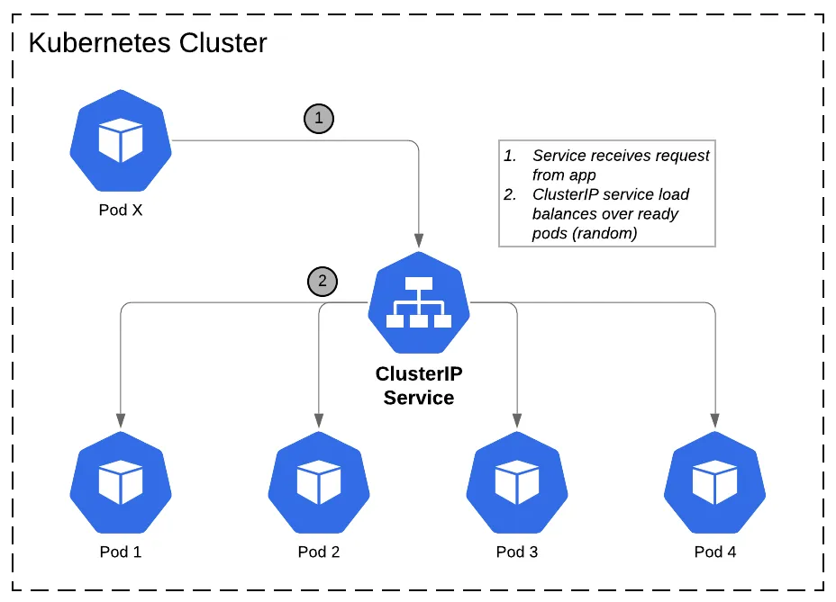
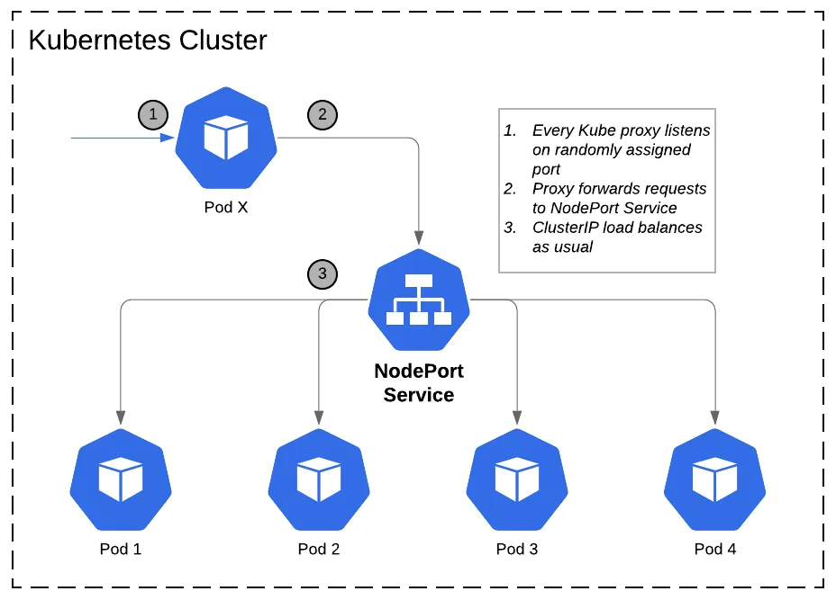

# Kubernetes (쿠버네티스) (작성중)

Created: Apr 30, 2021 8:26 PM

**Docker Engine, Docker Swarm, Docker Compose** 의 프로젝트들의 개념을 한군데로 모아 사용할 수 있는 훌륭한 프로젝트가 존재하는데 이게 바로 Kubernetes이다.

쿠버네티스는 오늘 상 사실 상 표준으로 사용되고 있는 컨테이너 오케스트레이션 도구이다. 구글에서 오픈소스로 공개했으며 현재는 CNCF (Cloud Native Computing Foundation)에서 관리되고 있다.

쿠버네티스는 다른 오픈소스 컨테이너 오케스트레이션 툴과 비교해 매우 많은 장점이 존재한다. 

- **서버 자원 클러스터링, 마이크로 서비스의 구조의 컨테이너 배포, 서비스 장애 복구등 컨테이너 기반의 서비스 운영에 필요한 대부분 오케스트레이션 기능을 폭넓게 지원한다.**
- **구글, 레드햇을 비롯한 많은 오픈소스 진영에서 쿠버네티스의 소스코드에 기여하고 있기 때문에 성능과 안정성 면에서 신뢰받고 있다.**
- **영속적 볼륨(Persistent Volume) 스케줄링, 장애 복구, 오토 스케일링, 서비스 디스커버리 및 인그레스 등 컨테이너 기반의 클라우드를 운영할 때 필요한 대부분의 기능과 컴포넌트들을 사용자가 직접 커스터마이징 할 수 있다.**
- **CNCF 및 다른 클라우드 운영도구와 쉽게 호환된다.**

Docker for Mac 또는 Docker for Windows를 설치하면 쉽게 Kubernetes를 이용할 수 있다. 하지만 이러한 것들은 1개의 노드에서만 쿠버네티스를 설치하고 사용하기 때문에 모든 기능을 완벽하게 사용해보기에는 적합하지 않다.

### 모든 리소스는 오브젝트 형태로 관리된다.

쿠버네티스는 대부분의 리소스를 '오브젝트'라고 불리는 형태로 관리한다. 예를 들어 쿠버네티스에서는 컨테이너의 집합인 Pod, 컨테이너의 집합을 관리하는 Replica Set, 심지어 사용자 Service Account, 노드 Node 까지도 하나의 오브젝트로 사용할 수 있다.

Kubernetes에서 사용할 수 있는 오브젝트는 다음과 같은 명령어로 알 수 있습니다.

```bash
kubectl api-resources
```

### 쿠버네티스는 YAML 파일을 사용한다.

쿠버네티스에서는 **kubectl**을 이용하여 거의 모든 명령어를 실행할 수 있다.
또한 YAML 파일을 이용하여 컨테이너 리소스를 생성하거나 삭제할 수 있으며, 컨테이너 뿐만 아니라 리소스 오브젝트들에까지 사용할 수 있다. 예를들어 ConfigMap(설정값), Secrets(비밀값) 등 모두 YAML 파일로 정의할 수 있다.

 

### 쿠버네티스는 여러개의 컴포넌트로 구성된다.

쿠버네티스에서 노드의 역할은 크게 Master와 Worker로 구분된다. Master 노드는 쿠버네티스가 제대로 동작할 수 있게 클러스터를 관리하는 역할을 담당하며, Worker 노드는 애플리케이션 컨테이너가 동작하는 환경이다.

쿠버네티스 클러스터 구성을 위해 kubelet이라는 Agent가 모든 노드에서 동작하게 되는데, 이는 컨테이너의 생성, 삭제 뿐만 아니라 마스터와 워커 노드 간 통신 역할을 담당하는 매우 중요한 Agent이다.

또한 쿠버네티스는 도커 Daemon 또한 하나의 컨테이너이다. 쿠버네티스는 도커의 내장 기능이 아닌, 단지 컨테이너를 사용하기 위해 도커를 이용하는 방식이며, 도커카 아니라도 CRI(Container Runtime Interface) 를 구현한 다른 컨테이너를 이용할 수 있다.

### 포드(Pod) : 컨테이너를 다루는 기본 단위

쿠버네티스에서는 컨테이너 애플리케이션을 구동하기 위해 반드시 알아야 몇 가지 오브젝트가 존재한다. 바로 포드(Pod), 레플리카셋(Replica Set), 서비스(Service), 디플로이먼트(Deployment) 이다.

포드란 컨테이너 애플리케이션의 기본 단위이다. 포드는 1개 이상의 컨테이너로 구성된 컨테이너의 집합으로 가장 기초적인 개념이다.

다음은 Nginx 컨테이너로 구성된 포드이다.

```yaml
# nginx-pod.yaml
apiVersion: v1 # 오브젝트의 API Version을 명시한다.
kind: Pod # 리소스의 종류를 나타낸다.
metadata: # Label, Name, Annotation 등과 같은 리소스 부가정보를 입력한다.
  name: my-nginx-pod
spec: # 리소스를 생성하기 위한 자세한 정보를 입력한다.
  containers: # 컨테이너
  - name: my-nginx-container
    image: nginx:latest
    ports:
    - containerPort: 80 # 사용할 포트를 명시하긴 했지만 해당 포트가 외부에서 접근한것은 아니다.
      protocol: TCP
```

이후 해당 포드는 다음과 같은 명령어로 실행, 삭제, 조회한다.

```yaml
kubectl apply -f nginx-pod.yaml

kubectl delete -f nginx-pod.yaml

kubectl get pods
```

생성된 리소스의 자세한 정보를 얻고 싶다면 describe 명령어, 명령을 전달하고 싶다면 exec를 사용할 수 있다. 또한 컨테이너 내의 로그도 확인할 수 있다.

```yaml
kubectl describe pods nginx-pod.yaml
kubectl exec -it nginx-pod bash
kubectl logs nginx-pod
```

### 레플리카셋(Replica Set) : 일정 개수의 포드를 유지하는 컨트롤러

쿠버네티스는 여러개의 컨테이너를 추상화 해 하나의 애플리케이션으로 구성하도록 만드는 훌륭한 컨테이너 묶음이다. 그러나 YAML에 포드만 정의해 생성하면 실제로 외부요청을 분산하기 힘들고 장애가 발생했을때 포드의 복구가 되지 않는다.

레플리카셋을 이용하면 Nginx포드를 안정적으로 여러개 실행할 수 있고, 워커 노드에 장애가 생기더라도 정해진 개수의 포드를 유지할 수 있다. 이처럼 Replica Set이 우리 대신 포드를 관리하기 때문에 우리가 직접 포드를 관리하지 않아도 된다.

```yaml
apiVersion: apps/v1
kind: ReplicaSet
metadata:
  name: replicaset-nginx
spec:
  replicas: 3
  selector:
    matchLabels:
      app: nginx-pod-label
  template:
    metadata:
      name: nginx-pod
      labels:
        app: nginx-pod-label
    spec:
      containers:
      - name: nginx
        image: nginx:latest
        ports:
        - containerPort: 80
```

레플리카 셋은 Label Selector를 이용해 실제 포드와 느슨한 연결을 할 수 있다. Label은 Key와 Value로 구성되어 있으며 특히 라벨은 포드등의 쿠버네티스 리소스를 분류할 때 유용하게 사용할 수 있는 메타데이터이다.

### 디플로이먼트(Deployment) : 레플리카 셋, 포드의 배포를 관리

레플리카셋만 사용해도 충분히 마이크로서비스 구조의 컨테이너를 구성할 수 있을것 같지만 실제로 레플리카 셋만 이용하여 YAML을 정의하는 경우는 거의 없다. 디플로이먼트는 레플리카셋의 상위 오브젝트로써 디플로이먼트에 대응하는 레플리카셋도 함께 생성된다. 따라서 디플로이먼트를 사용하면 포드와 레플리카 셋을 직접 생성할 필요가 없다.

```yaml
apiVersion: apps/v1
kind: Deployment
metadata:
  name: nginx-deployment
spec:
  replicas: 3
  selector:
    matchLabels:
      app: nginx-pod-label
  template:
    metadata:
      name: nginx-pod
      labels:
        app: nginx-pod-label
    spec:
      containers:
      - name: nginx
        image: nginx:latest
        ports:
        - containerPort: 80
```

디플로이먼트를 사용하는 이유는 애플리케이션의 업데이트와 배포를 더욱 편리하게 만들기 위해서이다. 디플로이먼트라는 이름의 Deploy 단어의 뜻이 나타내는 것 처럼 디플로이먼트는 컨테이너의 애플리케이션을 배포하고 관리하는 역할을 담당한다. 

컨테이너의 이미지를 변경해야 한다고 가정했을때 포드의 이미지를 변경할 때는 kubectl set image 명령어를 사용할 수 있다.

이미지를 업데이트함으로써 새롭게 생성되는 포드들이 있는데 이는 한개의 ReplicaSet이 아닌 2개의 ReplicaSet으로, Rolling Update를 수행하고, 이전의 정보는 Revision으로 저장한다.

### 서비스 (Service) : 포드를 연결하고 외부로 유출

YAML 파일에서 containerPort 항목을 정의했다고 해서 이 포드가 바로 외부로 노출되는것은 아니다. 이 포트를 외부로 노출해 사용자들이 접근하거나, 다른 Deployment의 포드들이 내부적으로 접근하려면 서비스(Service)라고 부르는 별도의 쿠버네티스 오브젝트를 생성해야 한다.

서비스는 다음과 같은 기능을 가지고 있다.

- 여러개의 포드에 쉽게 접근할 수 있도록 고유한 도메인 이름을 부여한다.
- 요청을 분산하는 로드 밸런스 기능을 수행한다.
- 클라우드 플랫폼의 로드 밸런서, 클러스터 노드의 포트등을 통해 포드를 외부로 노출한다.

**서비스의 종류**

쿠버네티스의 서비스는 포드에 어떻게 접근할 것이냐에 따라 종류가 여러 개로 세분화 되어있다. 따라서 목적에 맞는 적절한 서비스의 종류를 선택해야 한다.

- ClusterIP 타입 : 쿠버네티스 내부에서만 포드들에 접근할때 사용한다. 즉 클러스터 내부에서만 사용되는 포드에 적합하다.
- NodePort 타입 : 포드에 접근할 수 있는 포트를 클러스터의 모든 노드에게 동일하게 개방한다. 따라서 외부에서 접근할 수 있는 서비스 타입이다. 접근할 수 있는 포트는 랜덤이지만 특정 포트로 지정할 수 있다.
- LoadBalancer 타입 : 클라우드 플랫폼에서 제공하는 로드 밸런스를 동적으로 프로비저닝해 포드에 연결한다. NodePort타입과 마찬가지로 외부에서 포드에 접근할 수 있는 서비스 타입이다.

**ClusterIP 타입의 서비스 - 쿠버네티스 내부에서만 포드에 접근하기**

```yaml
apiVersion: v1
kind: Service
metadata:
  nome: hostname-svc-clusterip
spec:
  ports:
  - name: web-port
    port: 8080
    targetPort: 80
    selector:
      app: webserver #이 서비스에서 어떠한 라벨을 가지는 포드에 접근할 수 있게 만들 것인지 결정한다.
    type: ClusterIP```yaml
apiVersion: v1
kind: Service
metadata:
  nome: hostname-svc-clusterip
spec:
  ports:
    - name: web-port
      port: 8080
      targetPort: 80
  selector:
    app: webserver #이 서비스에서 어떠한 라벨을 가지는 포드에 접근할 수 있게 만들 것인지 결정한다.
  type: ClusterIP
```

Service는 쿠버네티스 내부에서만 사용할 수 있는 고유한 IP를 할당받는다. spec.ports.port 항목은 할당된 IP로 접근할 때 사용할 포트를 지정한다. 또한 spec.ports.targetPort는 selector 항목이 지정한 라벨에 의해 접근되는 포드들이 내부적으로 사용하는 포트를 의미한다.

서비스의 IP와 포트를 통해 포드에 접근할 수 있으며, 서비스와 연결된 여러개의 포드에 자동으로 요청이 분산된다. 서비스에는 IP뿐만 아니라 서비스 이름 자체로도 접근할 수 있다. 쿠버네티스는 내부 DNS를 구동하고 있으며, 포드들은 이 DNS를 사용하도록 설정된다.



이때 ClusterIP 서비스는 외부에서 접근할 수 없다는점에 유의해야 한다. 외부에 포드를 노출해야 한다면, NodePort 또는 LoadBalancer 타입의 서비스를 생성해야 한다.

**NodePort 타입의 서비스 - 서비스를 이용해 포드를 외부로 노출한다.**

NodePort타입의 서비스는 클러스터 외부에서도 접근할 수 있다. 단 NodePort라는 이름에서 알 수 있듯 해당 서비스는 모든 노드(Node)의 특정 포트(Port)를 개방해 서비스에 접근하는 방식이다. NodePort 타입의 서비스를 생성하기 위해서는 아래와 같이 작성한다.


```yaml
apiVersion: v1
kind: Service
metadata:
	name: hostname-svc-nodeport
spec:
	ports:
		- name: web-port
			port: 8080
			targetPort: 80
	selector:
		app: webserver
	type: NodePort
```

 
NodePort 타입의 서비스 또한 ClusterIP, 즉 내부 IP가 주어진다. 이는 NodePort타입의 서비스가 ClusterIP 기능을 포함하기 때문이다. 즉 NodePort타입의 서비스는 내부 네트워크와 외부 네트워크에서 동시에 접근할 수 있다.



**LoadBalancer 타입의 서비스 - 클라우드 플랫폼의 로드 밸런서와 연동하기**

로드밸런서 타입의 서비스는 생성과 동시에 로드 밸런서를 생성해 포드와 연결한다. NodePort 같은 경우 각 노드의 IP의 포트를 개방해 Pod에 접근하는것이였지만, 로드밸런서 타입의 서비스는 클라우드 플랫폼으로부터 도메인 이름과 IP를 할당받기 때문에 NodePort보다 더욱 쉽게 포드에 접근할 수 있다.

단, 해당 서비스는 로드 밸런서를 동적으로 프로비저닝 하는 기능을 제공하는 환경에서만 사용할 수 있다. 일반적으로 AWS, GCP 등과 같은 클라우드 플랫폼 환경에서만 LoadBalancer 타입을 사용할 수 있으며 가상 머신이나 온프레미스 환경에서는 사용하기 어려울 수 있다.

```yaml
apiVersion: v1
kind: Servicemetadata:	
name: hostname-svc-lb
spec:
  ports:		
  - name: web-port	
  port: 80			
  targetPort: 80
  selector:		
    app: webserver
  type: LoadBalancer
```

LoadBalancer 타입 또한 NodePort나 ClusterIP와 동일하게 서비스의 IP가 할당됐으며, 클러스터 내에서는 서비스의 IP 또는 서비스의 이름으로 접근할 수 있다.

이때 중요한것은 LoadBalancer 타입의 서비스는 EXTERNAL-IP가 할당된다는것이다. 이 주소는 클라우드 플랫폼으로부터 자동으로 할당된것이며 이 주소와 80포트를 통해 포드에 접근할 수 있다.

LoadBalancer 타입의 서비스는 포드로 요청을 전송할때 NodePort를 이용한다. 즉 요청이 들어오면 쿠버네티스  클러스터 내의 워커 노드 중 하나로 전달되며 이는 LoadBalancer타입의 서비스가 NodePort를 간접적으로 이용한다고 생각하면 된다.

**트래픽의 분배를 결정하는 서비스 속성**

LoadBalancer 타입의 서비스를 사용하면 외부로부터 들어온 요청은 각 노드 중 하나로 보내지며, 그 노드에서 다시 포드중 하나로 전달된다. 

이때 노드로 보내진 요청이 해당 노드에 있는 포드로 가는것이 아니라 다른 노드에 있는 포드로 요청이 전해질 수 있다. 이는 네트워크의 불필요한 트래픽을 소모한다.

이러한 요청 전달 매커니즘은 서비스의 속성 중 externalTrafficPolicy 항목에 정의되어 있다.

```yaml
apiVersion: v1
kind: Service
metadata:
  annotations:
  externalTrafficPolicy: Cluster
```

externalTrafficPolicy가 Cluster는 NodePort와 LoadBalancer 타입의 서비스가 기본적으로 동작하는 방식이다. 즉 클러스타 내 모든 노드에 랜덤한 포트를 개방하는 방식이다.

그러나 externalTrafficPolicy를 Local로 설정하면 포드가 생성된 노드에서만 포드로 접근할 수 있으며, 로컬 노드에 위치한 포드 중 하나로 요청이 전달된다. 즉, 추가적인 네트워크 홉이 필요하지 않게된다.

**요청을 외부로 리다이렉트하는 서비스 : External Name**

쿠버네티스를 외부 시스템과 연동해야 할때는 External Name 타입의 서비스를 사용할 수 있다. ExternalName 타입의 서비스는 쿠버네티스와 별개로 존재하는 레거시 시스템에 연동해야 하는 상황에서 유용하게 사용할 수 있다.

```yaml
apiVersion: v1
kind: Service
metadata:
  name: externalname-svc
spec:
  type: ExternalName
  externalName: my.database.com
```

위의 설정은 쿠버네티스 내부의 포드들이 externalname-svc라는 이름으로 요청을 보낼 경우, 쿠버네티스 DNS는 my.database.com으로 접근할 수 있도록 CNAME 레코드를 반환한다.

### 쿠버네티스 리소스의 관리와 설정

**네임스페이스 : 리소스를 논리적으로 구분하는 장벽**

도커에서는 수백개의 컨테이너를 생성했더라도 `docker ps`명령어를 입력하면 모든 컨테이너의 목록을 확인할 수 있다. 하지만 용도에 따라 컨테이너와 관련된 리소스들을 구분 지을 수 있는 논리적인 그룹이 있다면 좋을것 이다.
쿠버네티스는 리소스들을 논리적으로 제공하기 위해 네임스페이스(namespace)라는 오브젝트를 제공한다.

네임스페이스란 포드, 레플리카셋, 디플로이먼트, 서비스 등과 같은 쿠버네티스 리소스들이 묶여 있는 하나의 가상공간 또는 그룹이라고 이해하면 된다.

네임스페이스는 namespace  또는 ns라는 이름으로 쿠버네티스에서 사용할 수 있으며, 네임스페이스의 목록은 `kubectl get namespaces` 명령어로 확인할 수 있다.

네임스페이스는 쿠버네티스의 리소스를 논리적으로 묶을 수 있는 가상 클러스터처럼 사용할 수 있다. 쿠버네티스 클러스터를 여러 명이 동시에 사용해야 하는데, 사용자마다 네임스페이스를 별도로 생성해 사용하도록 설정할 수 있다. 하지만 각 네임스페이스의 리소스들은 논리적으로만 구분된것이며, 물리적으로 격리된것이 아니다. 즉 서로 다른 네임스페이스에 존재하는 포드가 같은 노드에 존재할 수 있다.

**컨피그맵, 시크릿 : 설정값을 포드에 전달**

대부분의 애플리케이션은 설정값을 가지고 있으며 이런 설정은 단순히 키-값 형태의 설정일 수 있수도 있고, nginx.conf 와 같이 완전한 하나의 파일을 사용해야할 수 도 있다.

이러한 설정값이나 설정 파일을 애플리케이션에 전달하는 가장 확실한 방법은 도커 이미지 내부에 설정값 또는 설정 파일을 정적으로 저장하고 이미지를 빌드하는것이다. 하지만 이 방법은 설정 옵션을 유연하게 변경할 수 없다는 단점이 존재한다.

쿠버네티스는 YAML파일과 설정값을 분리할 수 있는 ConfigMap과 Secret이라는 오브젝트를 제공한다. 

**컨피그맵 (ConfigMap)**

컨피그맵은 일반적인 설정값을 담아 저장할 수 있는 쿠버네티스 오브젝트이며, 네임스페이스에 속하기 때문에 네임스페이스 별로 컨피그맵이 존재한다.

컨피그맵을 생성하는 방법은 YAML파일을 통해 정의할 수 도 있고, Literal, file이라는 옵션을 이용해도 컨피그맵을 생성할 수 있다.

컨피그맵을 포드에서 사용하는 방식은 크게 2가지다.

1. 컨피그맵의 값을 환경 변수로 사용
2. 컨피그맵의 값을 내부 파일로 마운트 하여 사용

**컨피그맵을 환경변수로 사용하기**

```yaml
apiVersion: v1
kind: Pod
metadata:
  name: container-env-example
spec:
  containers:
    - name: my-container
      image: busybox
      args: ['tail', '-f', '/dev/null']
      envFrom:
      - configMapRef:
          name: log-level-configmap
```

위의 YAML파일 내용중에서 ConfigMap을 사용하는 항목은 **envFrom, configMapRef** 이다. envFrom 항목은 하나의 컨피그맵에 여러 개의 키-값 쌍이 존재하더라도 모두 환경 변수로 가져오도록 설정한다.

하지만 일부 값만 가져오고 싶다면 valueFrom과 configMapKeyRef를 사용할 수 있다.

```yaml
env:
  - name: ENV_KEY_NAME_1      #컨테이너에 새롭게 등록될 환경 변수 이름 1
    valueFrom:
      configMapKeyRef:
        name: log-level-configmap
        key: LOG_LEVEL
  - name: ENV_KEY_NAME_2      #컨테이너에 새롭게 등록될 환경 변수 이름 2
    valueFrom:
      configMapKeyRef:
        name: container-configmap
        key: container
```

**컨피그맵의 내용을 파일로 포드 내부에 마운트하기**

애플리케이션이 nginx.conf, mysql.conf와 같은 특정 파일로부터 설정값을 읽어 온다면 ConfigMap의 데이터를 포드 내부로 마운트하여 사용할 수 있습니다.

```yaml
apiVersion: v1
kind: Pod
metadata:
  name: configmap-volume-pod
spec:
  containers:
    - name: my-container
      image: busybox
      args: ["tail", "-f", "/dev/null"]
      volumeMounts:
      - name: configmap-volume
        mountPath: /etc/config
volumes:
  - name: configmap-volume
    configMap:
      name: container-configmap
```

쿠버네티스에서는 ConfigMap을 사용하기 위해 볼륨을 정의한다. 이후에 이 불륨을 포드 내부의 디렉터리로 마운트하여 사용한다.

**파일로부터 컨피그맵 생성하기**

컨피그맵을 볼륨으로 포드에 제공할 때는 대부분 설정 파일 그 자체를 컨피그맵으로 사용하는 경우가 많다.

`kubectl create configmap <컨피그맵 이름> —from-file <파일 이름>`  이때 별도 키를 지정하지 않으면 파일 이름이 키가 되며 파일 내용이 값이 된다.

**YAML파일로 컨피그맵 생성하기**

컨피그맵은 반드시 명령어를 통해 생성해야 한다. kubectl create 명령어에서 —dry-run과 -o yaml 옵션을 사용하면 컨피그맵을 생성하지 않은 채로 YAML 파일의 내용을 출력할 수 있다.

 이를 이용해 yaml 파일로 저장한 뒤, `kubectl apply` 명령어로 컨피그맵을 생성한다.
