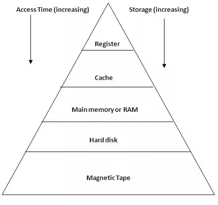
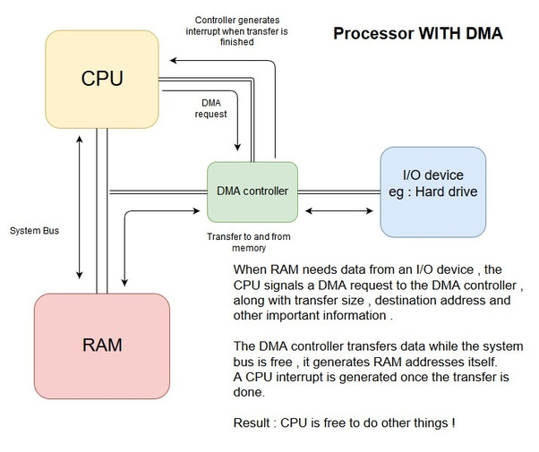
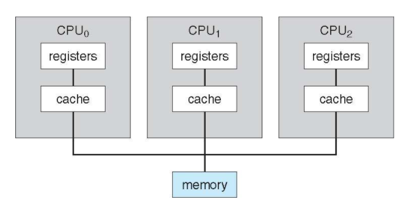
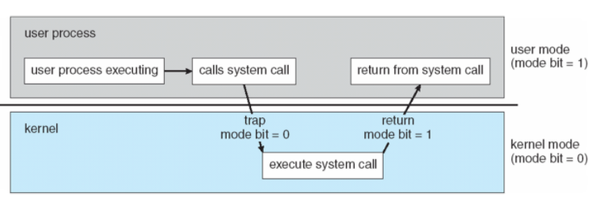

# Operating System

# 목차

- [운영체제란 무엇인가](#운영체제란-무엇인가)

# 운영체제란 무엇인가

가장 간단하게 말하자면, 운영체제라는 컴퓨터의 하드웨어를 관리하는 프로그램이다. 컴퓨터는 하드웨어만 있다고 동작하지 않는다. 하드웨어 위에서 소프트웨어가 동작하는데, 이때 소프트웨어들은 하드웨어의 자원들을 사용할 필요가 있다. 이때 운영체제가 필요하다. 운영체제는 소프트웨어에게 하드웨어의 자원들을 어떻게 분배할 것인가? 에 대한 프로그램이다.

**OS is a resource allocator** 즉, OS는 컴퓨터의 모든 자원을 관리하고, 자원을 효율적으로 공평하게 사용하기 위해 누구에게 자원을 할당할 것인지 결정하는 프로그램이다.

### Interrupt Driven

CPU와 I/O 장치들은 동시적으로 작동한다. 
 I/O장치들은 장치 컨트롤러 (Device Controller)라는것이 존재하고, 그 안에 Local Buffer가 존재한다. I/O란 Device와 Device Controller간의 데이터 전달이다. 
**Input이란** Device에서 Device Controller의 지역 버퍼로 데이터가 옮겨지는 과정이고, **Output이란** Device Controller에서 Device로 데이터가 옮겨지는 과정이다. 
이후 Device Controller에서 I/O작업이 끝나면 CPU에게 Interrupt를 발생시키고, 이 후에 CPU는 해당 Interrupt를 처리하기 위해 작동하게되는것이다. 
그렇기 때문에 CPU가 I/O작업을 위해 기다리는것은 매우 비효율적이다. 그래서 보통 CPU는 I/O작업이 필요하면 일을 맡기고 CPU는 다른 일을 수행하게된다.

일반적으로 인터럽트는 처리하기 위한 소프트웨어가 존재한다. 이를 **Interrupt Service Routine**이라고 하는데, 인터럽트가 발생하면 CPU는 인터럽트를 처리하기 위해 해당 루틴으로 JUMP해서 인터럽트를 처리한다. 

RAM에는 Interrupt Service Routine들의 주소를 저장해놓은 Vector가 존재한다. 이를 Interrupt Vector라고 한다.

Interrupt는 하드웨어에서만 발생하는게 아니다. 소프트웨어에서도 Interrupt를 발생시킬 수 있는데 이를 Trap 또는 Exception이라고 한다. 이는 Error또는 User의 Request를 통해 발생한다.

**운영체제는 Interrupt Driven으로 동작한다.**

### I/O Structure

Process에서 I/O가 필요할때, CPU는 I/O Request를 하고 무엇을 할것인가?

1. I/O가 끝날때까지 CPU를 Wait하고, I/O가 끝나면 재동작하는 방식
2. 아무일도 하지 않는 Loop를 만들어서 동작 (Busy Waiting)
3. I/O가 끝날때까지 다른 프로그램을 동작하고, I/O가 끝나면 프로그램 재시작

**I/O는 CPU에 비해 굉장히 느리다. 그렇기때문에 CPU가 Wait 하는방식은 굉장히 비효율적이기 때문에 1번, 2번 방식은 사용하지 않는다.** 

### Main Memory

Main Memory란 CPU가 직접 접근할 수 있는 큰 Storage 장치이다. 

- Random Access : 메모리에 어느 위치에 접근하든지간 접근속도는 동일하다.
- Volatile : 휘발성 저장 장치이다.

Main Memory는 Random Access Memory라고 해서 줄여서 RAM이라고 불린다.

### Secondary Memory

큰 용량을 제공하는 저장 장치로, 비 휘발성이고 용량이 크다. 예전에는 자기 디스크를 많이 이용했지만 요즘에는 SSD라는 전자식 드라이브를 이용하여, 속도면에서 많은 효율을 얻고 있다.

### Memory Hierarchy

저장장치는 계층화 되어있다. 

일반적으로 저장장치는 크게 접근 속도, 용량, 휘발성 3가지 특성을 이용하여 분류할 수 있다. 메모리 계층구조 위에서 아래로 향할 수록 데이터에 대한 접근시간이 길어지지만, 용량은 커진다.
MainMemory까지는 Volatility를 가지며, 그 아래로는 None-Volatility이다.

Cache란 컴퓨터 시스템의 여러곳에서 사용되는 기술로, 자주 사용되거나 최근에 사용된 데이터를 복사하여 저장하고, 이 후에 더 빠른속도로 데이터에 접근할 수 있게 해주는 기술이다. 메모리 계층구조에서 Cache는 레지스터와 RAM사이에 존재한다.

### Direct Memory Access

I/O속도가 매우 빠른 장치의 경우 Interrupt가 빈번하게 발생한다. CPU는 Interrupt가 발생하면, Interrupt를 처리해야하므로, 빈번하게 발생하는 상황에 대해서 CPU는 자기가 할 일을 제대로 하지 못 할 수 있다. 그래서 나온것이 **DMA(Direct Memory Access)**이다. DMA는 Device들이 메모리에 직접 접근하여 읽거나 쓸 수 있도록 하는 기능을 의미하는데 여기서 중요한 것은 CPU가 이 과정에 개입하지 않는다는 것이다.

DMA를 이용해서, CPU가 해야할 일을 대신 처리하게 되면서, CPU의 효율을 늘리고 DMA는 데이터의 전송이 종료되었을때 1 Block 데이터의 단위로 CPU에게 Interrupt를 걸게 된다. 이는 결과적으로 CPU가 받는 Interrupt의 횟수를 줄이게 된다.

### MultiProcessing System

멀티 프로세싱 시스템은 여러개의 프로세서가 버스 때때로는 클락, 메모리를 공유하는 시스템이다. 이러한 시스템의 장점은 다음과같다.

- 처리량이 향상된다.

    프로세서의 수가 많아짐으로써, 적은 시간내에 더 많은 일을 처리할 수 있게된다. 하지만 프로세서가 N배 된다고해서 처리량이 N배가 되는것은 아니다. 다수의 프로세서가 협력하면서 생기는 오버헤드가 존재하기 때문이다.

- 경제적이다

    멀티 프로세싱 시스템은 다수의 싱글 프로세싱 시스템보다 경제적이다. 

- 안정성이 높아진다.

    몇개의 프로세서가 분산되어 일을 처리하기 때문에 한개의 프로세서가 고장나도, 전체 시스템이 중단되지는 않는다. 단지 느려질뿐이다. 

멀티 프로세싱 시스템은 2가지 타입이 존재한다.

- Asymmetric Multiprocessing (비대칭 멀티 프로세싱)

    각 프로세서가 특정한 일만 처리한다. 예를들면 Boss 프로세서는 시스템과 관련된 일을 처리하고, 다른 프로세서들은 미리 정의된 일만 처리하는 방식이다.

- Symmetric Multiprocssing (대칭 멀티프로세싱)

    일의 구분없이 프로세서들이 일을 처리한다. 

## 운영체제가 하는 역할

### Job Scheduling

MultiProgramming 이란 메인 메모리에 여러 작업을 두고 I/O가 일어날때마다 다른 작업을 실행하는 방식이다. CPU는 동시에 한개의 작업만 실행할 수 있기 때문에 한 작업만 계속 실행해서는 안된다. 그렇기 때문에 I/O가 발생할때마다 다른 작업을 선택하는데 이는 운영체제가 Job Scheduling을 통해 선택하게 된다.

### Dual Mode

운영체제는 Mode Bit을 통해 OS를 다른 시스템으로부터 보호한다. User Mode와 Kernal Mode가 존재하며, Mode bit을 이용하면 시스템이 현재 User Code를 실행하는지, Kernal Code를 실행하는지 알 수 있다. 또한 몇가지 명령같은 경우 Kernal Mode의 권한으로만 실행할 수 있는 경우도 존재한다. System Call이 그러한데, System Call 을 하기 위해서는 Mode bit를 커널로 해야하고, 이후에 종료되면 다시 User모드로 되돌린다.

### Process Management

프로세스란 프로그램이 실행중인 상태이다. 프로그램은 정적인 객체이며, 프로세스는 동적인 객체라고 생각할 수 있다. 프로세스는 자신의 일을 수행하기 위해 운영체제로부터 CPU와 메모리등을 할당받아서 자신의 일을 처리한다. Single Thread 프로세스 같은 경우 한가지의 Program Counter라는게 존재하는데 이것은 다음번에 실행할 명령어의 주소를 가르킨다. 만약 Multi Thread 프로세스라면 Thread 당 Program Counter가 생기게된다.

운영체제는 프로세스 생명주기를 관리한다. 시스템 프로세스를 생성하고 죽이거나, 중지하거나 재개한다. 또한 프로세스에게 동기화, 통신, DeadLock Handling 매커니즘을 제공하기도 한다.

### Memory Management

프로그램이 실행되기 위해서는 모든 명령 또는 데이터는 Main Memory에 존재해야한다. 운영체제는 어떤 프로세스가 어떤 메모리를 사용하는지 추적하고 프로세스가 필요한 만큼 메모리의 할당, 해제를 담당한다.

### File System Management

운영체제는 파일 시스템을 관리한다. 파일이나 폴더를 만들거나 삭제할 수 있으며, 파일에 대해 읽고 쓰는 기본적인 연산을 지원한다. 또한 파일을 백업할 수 있어야한다.

### Disk Management

운영체제는 디스크 공간을 할당하고, 디스크 읽기, 쓰기 요청을 스케줄링한다. 또한 캐시와 관련된 문제에서 HardDisk, RAM, Cache의 서로 같은 정보의 내용이 다르게 존재한다면 누가 최신의 정보인가를 처리해야한다. 이것을 Cache Coherence라고 한다.