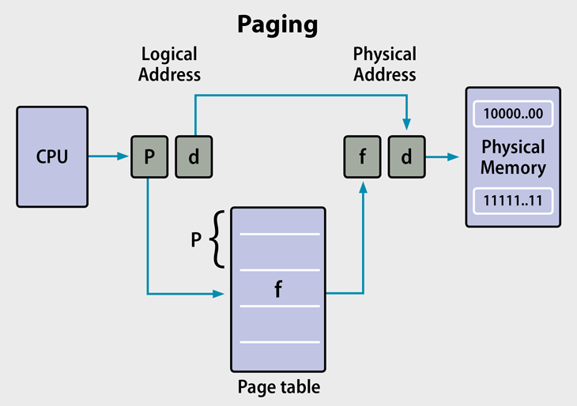

# Operating System


# 목차

- [운영체제란 무엇인가](#운영체제란-무엇인가)
- [운영체제가 하는 역할](#운영체제가-하는-역할)
- [프로세스](#process)
- [프로세스 스케줄링](#process-scheduling)
- [프로세스간 통신](#interprocesses-communication-프로세스간-통신)
- [쓰레드](#thread)
- [CPU Scheduler](#cpu-scheduler-short-term-scheduler)
- [프로세스 동기화](#프로세스-동기화)
- [교착상태](#교착-상태-dead-lock)
- [메모리](#memory)
- [페이징](#paging)
- [가상메모리](#가상-메모리)
- [캐시](#cache란)


# 운영체제란 무엇인가

가장 간단하게 말하자면, 운영체제라는 컴퓨터의 하드웨어를 관리하는 프로그램이다. 컴퓨터는 하드웨어만 있다고 동작하지 않는다. 하드웨어 위에서 소프트웨어가 동작하는데, 이때 소프트웨어들은 하드웨어의 자원들을 사용할 필요가 있다. 이때 운영체제가 필요하다. 운영체제는 소프트웨어에게 하드웨어의 자원들을 어떻게 분배할 것인가? 에 대한 프로그램이다.

**OS is a resource allocator** 즉, OS는 컴퓨터의 모든 자원을 관리하고, 자원을 효율적으로 공평하게 사용하기 위해 누구에게 자원을 할당할 것인지 결정하는 프로그램이다.

### Interrupt Driven

CPU와 I/O 장치들은 동시적으로 작동한다. 
 I/O장치들은 장치 컨트롤러 (Device Controller)라는것이 존재하고, 그 안에 Local Buffer가 존재한다. I/O란 Device와 Device Controller간의 데이터 전달이다. 
**Input이란** Device에서 Device Controller의 지역 버퍼로 데이터가 옮겨지는 과정이고, **Output이란** Device Controller에서 Device로 데이터가 옮겨지는 과정이다. 
이후 Device Controller에서 I/O작업이 끝나면 CPU에게 Interrupt를 발생시키고, 이 후에 CPU는 해당 Interrupt를 처리하기 위해 작동하게되는것이다. 
그렇기 때문에 CPU가 I/O작업을 위해 기다리는것은 매우 비효율적이다. 그래서 보통 CPU는 I/O작업이 필요하면 일을 맡기고 CPU는 다른 일을 수행하게된다.

일반적으로 인터럽트는 처리하기 위한 소프트웨어가 존재한다. 이를 **Interrupt Service Routine**이라고 하는데, 인터럽트가 발생하면 CPU는 인터럽트를 처리하기 위해 해당 루틴으로 JUMP해서 인터럽트를 처리한다. 

RAM에는 Interrupt Service Routine들의 주소를 저장해놓은 Vector가 존재한다. 이를 Interrupt Vector라고 한다.

Interrupt는 하드웨어에서만 발생하는게 아니다. 소프트웨어에서도 Interrupt를 발생시킬 수 있는데 이를 Trap 또는 Exception이라고 한다. 이는 Error또는 User의 Request를 통해 발생한다.

**운영체제는 Interrupt Driven으로 동작한다.**

### I/O Structure

Process에서 I/O가 필요할때, CPU는 I/O Request를 하고 무엇을 할것인가?

1. I/O가 끝날때까지 CPU를 Wait하고, I/O가 끝나면 재동작하는 방식
2. 아무일도 하지 않는 Loop를 만들어서 동작 (Busy Waiting)
3. I/O가 끝날때까지 다른 프로그램을 동작하고, I/O가 끝나면 프로그램 재시작

**I/O는 CPU에 비해 굉장히 느리다. 그렇기때문에 CPU가 Wait 하는방식은 굉장히 비효율적이기 때문에 1번, 2번 방식은 사용하지 않는다.** 

### Main Memory

Main Memory란 CPU가 직접 접근할 수 있는 큰 Storage 장치이다. 

- Random Access : 메모리에 어느 위치에 접근하든지간 접근속도는 동일하다.
- Volatile : 휘발성 저장 장치이다.

Main Memory는 Random Access Memory라고 해서 줄여서 RAM이라고 불린다.

### Secondary Memory

큰 용량을 제공하는 저장 장치로, 비 휘발성이고 용량이 크다. 예전에는 자기 디스크를 많이 이용했지만 요즘에는 SSD라는 전자식 드라이브를 이용하여, 속도면에서 많은 효율을 얻고 있다.

### Memory Hierarchy

저장장치는 계층화 되어있다. 


일반적으로 저장장치는 크게 접근 속도, 용량, 휘발성 3가지 특성을 이용하여 분류할 수 있다. 메모리 계층구조 위에서 아래로 향할 수록 데이터에 대한 접근시간이 길어지지만, 용량은 커진다.
MainMemory까지는 Volatility를 가지며, 그 아래로는 None-Volatility이다.

Cache란 컴퓨터 시스템의 여러곳에서 사용되는 기술로, 자주 사용되거나 최근에 사용된 데이터를 복사하여 저장하고, 이 후에 더 빠른속도로 데이터에 접근할 수 있게 해주는 기술이다. 메모리 계층구조에서 Cache는 레지스터와 RAM사이에 존재한다.

### Direct Memory Access

I/O속도가 매우 빠른 장치의 경우 Interrupt가 빈번하게 발생한다. CPU는 Interrupt가 발생하면, Interrupt를 처리해야하므로, 빈번하게 발생하는 상황에 대해서 CPU는 자기가 할 일을 제대로 하지 못 할 수 있다. 그래서 나온것이 **DMA(Direct Memory Access)**이다. DMA는 Device들이 메모리에 직접 접근하여 읽거나 쓸 수 있도록 하는 기능을 의미하는데 여기서 중요한 것은 CPU가 이 과정에 개입하지 않는다는 것이다.


DMA를 이용해서, CPU가 해야할 일을 대신 처리하게 되면서, CPU의 효율을 늘리고 DMA는 데이터의 전송이 종료되었을때 1 Block 데이터의 단위로 CPU에게 Interrupt를 걸게 된다. 이는 결과적으로 CPU가 받는 Interrupt의 횟수를 줄이게 된다.

### MultiProcessing System

멀티 프로세싱 시스템은 여러개의 프로세서가 버스 때때로는 클락, 메모리를 공유하는 시스템이다. 이러한 시스템의 장점은 다음과같다.

- 처리량이 향상된다.

    프로세서의 수가 많아짐으로써, 적은 시간내에 더 많은 일을 처리할 수 있게된다. 하지만 프로세서가 N배 된다고해서 처리량이 N배가 되는것은 아니다. 다수의 프로세서가 협력하면서 생기는 오버헤드가 존재하기 때문이다.

- 경제적이다

    멀티 프로세싱 시스템은 다수의 싱글 프로세싱 시스템보다 경제적이다. 

- 안정성이 높아진다.

    몇개의 프로세서가 분산되어 일을 처리하기 때문에 한개의 프로세서가 고장나도, 전체 시스템이 중단되지는 않는다. 단지 느려질뿐이다. 

멀티 프로세싱 시스템은 2가지 타입이 존재한다.

- Asymmetric Multiprocessing (비대칭 멀티 프로세싱)

    각 프로세서가 특정한 일만 처리한다. 예를들면 Boss 프로세서는 시스템과 관련된 일을 처리하고, 다른 프로세서들은 미리 정의된 일만 처리하는 방식이다.

- Symmetric Multiprocssing (대칭 멀티프로세싱)

    일의 구분없이 프로세서들이 일을 처리한다. 


## 운영체제가 하는 역할

### Job Scheduling

MultiProgramming 이란 메인 메모리에 여러 작업을 두고 I/O가 일어날때마다 다른 작업을 실행하는 방식이다. CPU는 동시에 한개의 작업만 실행할 수 있기 때문에 한 작업만 계속 실행해서는 안된다. 그렇기 때문에 I/O가 발생할때마다 다른 작업을 선택하는데 이는 운영체제가 Job Scheduling을 통해 선택하게 된다.

### Dual Mode

운영체제는 Mode Bit을 통해 OS를 다른 시스템으로부터 보호한다. User Mode와 Kernal Mode가 존재하며, Mode bit을 이용하면 시스템이 현재 User Code를 실행하는지, Kernal Code를 실행하는지 알 수 있다. 또한 몇가지 명령같은 경우 Kernal Mode의 권한으로만 실행할 수 있는 경우도 존재한다. System Call이 그러한데, System Call 을 하기 위해서는 Mode bit를 커널로 해야하고, 이후에 종료되면 다시 User모드로 되돌린다.


### Process Management

프로세스란 프로그램이 실행중인 상태이다. 프로그램은 정적인 객체이며, 프로세스는 동적인 객체라고 생각할 수 있다. 프로세스는 자신의 일을 수행하기 위해 운영체제로부터 CPU와 메모리등을 할당받아서 자신의 일을 처리한다. Single Thread 프로세스 같은 경우 한가지의 Program Counter라는게 존재하는데 이것은 다음번에 실행할 명령어의 주소를 가르킨다. 만약 Multi Thread 프로세스라면 Thread 당 Program Counter가 생기게된다.

운영체제는 프로세스 생명주기를 관리한다. 시스템 프로세스를 생성하고 죽이거나, 중지하거나 재개한다. 또한 프로세스에게 동기화, 통신, DeadLock Handling 매커니즘을 제공하기도 한다.

### Memory Management

프로그램이 실행되기 위해서는 모든 명령 또는 데이터는 Main Memory에 존재해야한다. 운영체제는 어떤 프로세스가 어떤 메모리를 사용하는지 추적하고 프로세스가 필요한 만큼 메모리의 할당, 해제를 담당한다.

### File System Management

운영체제는 파일 시스템을 관리한다. 파일이나 폴더를 만들거나 삭제할 수 있으며, 파일에 대해 읽고 쓰는 기본적인 연산을 지원한다. 또한 파일을 백업할 수 있어야한다.

### Disk Management

운영체제는 디스크 공간을 할당하고, 디스크 읽기, 쓰기 요청을 스케줄링한다. 또한 캐시와 관련된 문제에서 HardDisk, RAM, Cache의 서로 같은 정보의 내용이 다르게 존재한다면 누가 최신의 정보인가를 처리해야한다. 이것을 Cache Coherence라고 한다.


# Process

프로세스란 동적으로 실행되는 프로그램을 의미한다. 

프로세스는 크게 Stack 영역, Heap 영역, Data 영역, Text영역으로 분리된다.

**Text영역은** 프로세스가 실행할 코드가 기계어 형태로 저장된 공간이다. 운영체제가 Text 영역을 보호하기 때문에 수정할 수 없다.

Self Modifing Code와 같은 기법은 런타임에 Text 영역에 기계어 코드를 직접적으로 작성하여, 프로그램의 실행명령을 바꾼다. 운영체제에 메모리에 대한 READ, WRITE, EXECUTE 권한을 **mprotect()**라는 System Call을 요청하여 얻을 수 있다.

**Data영역은** 코드에서 선언한 전역변수, Static 변수 등등이 저장된 공간이다.


프로세스에서 **Stack 영역은** 일반적으로 위에서 아래로 할당된다. 보통 프로그램은 컴파일 타임에 선언된 변수를 확인하여, Stack의 크기를 결정한다. 

보통 Procedure를 실행하게 되면 한개의 **Activation Record**가 생기는데 이는 프로시저가 호출되면 Stack 영역에 한개씩 쌓이게 되고, Procedure가 종료되면 사라지게 된다. Activation Record는 프로시저의 실행에 필요한 데이터들을 관리한다.

Heap영역은 프로세스에서 필요할때마다 동적으로 할당받을 수 있는 메모리 영역이다. 즉 Heap의 사용량은 Runtime에 결정된다. 일반적으로 malloc()과 같은 System Call을 이용하면 Heap 영역의 메모리를 얻어서 사용할 수 있다. Heap 영역은 할당받고 사용을 완료했으면 반드시 메모리를 해제해야한다. 그렇지않으면 **Memory Leak (메모리 누수)**가 발생한다.

### Life Cycle

프로세스는 살아생전 총 5개의 상태를 가지게 된다.


- new : 프로세스가 처음 만들어진 상태
- ready : cpu를 운영체제로부터 할당받기전 대기중인 상태
- running : 명령이 실행중인 상태
- waiting : 어떤 사건 or I/O를 기다리고 있는 상태
- terminated : 프로세스가 종료된 상태

### Process Control Block

프로세스 제어 블록 일명 PCB는 프로세스의 관련 정보를 저장하는 구조체이다. 

일반적으로 Process의 Context Switching이 일어나면, 실행중인 프로세스 정보를 PCB에 기록하고, 기다리고 있던 다른 프로세스의 PCB를 읽어 해당 프로세스를 실행한다.


## Process Scheduling

CPU는 한정적인 하드웨어 자원이고, 운영체제는 어떤 프로세스에게 CPU를 할당할 것인지, 선택해야한다. 

일반적으로 스케줄링을 하기 위해서 여러개의 큐가 존재한다.

- Job Queue : Disk에서 Ready 상태로 가기전 프로세스들이 존재하는 Queue이다.
- Ready Queue : Memory에서 CPU를 받기 위해 기다리는 프로세스들이 존재하는 Queue이다.
- Device Queue : Device Controller에 존재하는 Queue이다. 프로세스들이 I/O장치를 이용하기 위해 대기한다.

### Long Term Scheduling

JobQueue에서 Ready Queue로 Job을 가져오는 Schduler이다. 이름 그대로 긴 주기를 가지고 한번씩 실행되며, 메모리에 있는 작업의 개수를 조절한다. 

### Short Term Scheduling

Ready중인 프로세스에게 CPU를 할당하는 스케줄러이다. 자주실행되며 매우 빨라야 한다.

### Type of Process

프로세스는 주로 작업하는 종류에 따라 2가지로 분류된다.

- I/O Bound Process : I/O 중심의 프로세스
- CPU Bound Process : CPU 중심의 프로세스

좋은 시스템 성능을 위해서는 I/O 중심의 프로세스와 CPU 중심의 프로세스를 Long - Term Scheduler가 적절히 선택해야 한다.

### Medium Term Scheduler

여러명의 사용자가 여러 프로세스를 실행시켜서 메인 메모리가 부족해진다면, 작업중인 일부의 프로세스를 디스크로 내려보내고 여유가 생기면 다시 올려서 실행한다. 이를 **Swapping**이라고 한다.

### Process의 생성과 종료

프로세스간 부모 자식 관계를 선으로 표시하면 Tree가 만들어 진다.

프로세스를 생성할때 Resource Sharing Option을 선택할 수 있다.

1. 모든 자원을 공유한다.
2. 일부 자원만 공유한다.
3. 공유하지 않는다.

또한 실행 Option을 선택할 수 있다.

1. 부모 자식 프로세스를 동시에 실행한다.
2. 자식 프로세스가 종료할때까지 부모 프로세스가 대기한다.


보통 프로세스는 Fork() 시스템 콜로 탄생하여, Exit() 이라는 시스템콜로 종료된다. 하지만 부모 프로세스가 abort() 시스템 콜을 이용하여 강제 종료 시킬 수 있다.

일반적으로 자식 프로세스는 부모 프로세스가 없으면 실행이 되지 않는다. 이때 2가지 전략이 존재한다.

1. 부모가 사라지면 모든 자식프로세스가 종료된다. (CasCade Termination)
2. 다른 프로세스의 양자로 들어간다.

만약 부모가 자식 프로세스의 종료를 기다리지 않고 있으면 PCB를 반납할 수 없다. 이는 좀비 프로세스를 생성하게 된다. 또한 이러한 상황에서 부모 프로세스가 종료된다면, 이때 자식 프로세스를 고아 프로세스라고 한다.

### Interprocesses Communication (프로세스간 통신)

우리는 실제로 프로그램을 동작시킬때 한개의 프로세스만 수행되지 않는 경우도 존재한다. 상황에 따라서 여러개의 프로세스가 협력해야하는 케이스가 많이 존재하며, 이때 협력하기 위해서 프로세스간 통신하는 방법이 필요하다. 보통 2가지 방법이 존재한다.

1. **Shared Memory**
   보통 Shared Memory는 공유메모리를 의미한다. Process끼리 공유하는 메모리가 존재하고, 이에 대해 접근할 수 있는것이다.
   보통 프로세스간 통신은 생산자와 소비자가 존재한다. 만약 Shared Memory가 무한하다면, 생산자는 Memory가 부족하다는것을 인지하지 못하고 계속해서 Message를 생산할 것이다. 하지만 Shared Memory는 유한하다. 그렇기 때문에 Producer - Consumer 문제가 발생한다.
   이러한 문제는 원형 Linked List를 이용하여 해결할 수 있다. 공유메모리에 접근할때 발생하는 동기화 문제는 프로세스끼리 알아서 잘해결해야한다. 즉 아래의 코드에서 in과 out은 상호배제이다. 

    ```java
    //Producer
    while(in + 1 == out) 
    	donothing //기다린다.
   
    //Consumer
    while(in == out)
    	donothing // 기다린다.
    ```

2. **Message Passing**
   프로세스간 동기화와 통신을 하기 위해서 사용한다. 

    - 직접 통신

      프로세스간 직접적으로 링크가 구성된다. 
      send(P, message) : P에게 메시지를 보낸다.
      receive(Q, message) : Q로부터 메시지를 받는다.

      

    - 간접 통신

      중간에 Mail Box를 두고 이곳에 메시지를 작성하고 읽어가는 방식으로 작동한다. Mail Box는 고유 Id가 존재한다. 이 방식은 여러개의 프로세스가 접근할 수 있고, Mail Box 자체를 여러개 생성하여 여러 링크를 구성할 수 있다.

      

3. **PIPE**

   파이프 또한 IPC 방법 중 하나이다. 파이프는 프로세스간 데이터를 주고 받는 통로를 의미한다.

   - Ordinary Pipe (익명 파이프)

     부모-자식 관계에서 데이터를 일방적으로 전달한다.

   - Named Pipe(이름있는 파이프)

     부모관계가 아니여도 양방향으로 데이터를 교환할 수 있다.

4. **Socket**

   컴퓨터 간 통신을 할때 사용한다. Socket이란 IP와 Port를 합친것을 의미한다. 

5. **RPC (Remote Procedure Call) 프로세스간 추상화된 프로시저 콜**

   Data는 기계에 따라서 Big-Endian 또는 Littel-Endian으로 나타나기때문에 기계에 종속적이다. 이때 이 Data를 기계에 독립적으로 변환하는것을 Marshalling이라고 한다. 
   RPC의 사용자는 다른 컴퓨터의 위치와 포트번호를 이용하여, RPC 메세지를 작성하고 데이터를 전송한다 이후 메서드 실행결과를 상대측으로부터 전달받는다.


# Thread

Thread는 CPU를 이용하기 위한 가장 기본적인 단위로, Thread ID, Program Counter, Register Set, Stack을 가지며, 다른 Thread들과 Code, Data, 자원들을 공유한다. 전통적인 프로세스는 프로세스당 한개의 스레드를 사용했지만, 만약 여러개의 스레드를 사용하게 된다면 단위시간당 처리량을 향상할 수 있게 된다. 이를 멀티 스레드 프로그램이라고 한다. 이 경우 스레드는 서로 독립적인 작업을 수행해야하기 때문에, 각자의 Stack과 Register Set을 가지게 된다.

**Thread는 한개의 독립적인 실행흐름이다.** 보통 Stack이라는 영역에는 함수 인자, 리턴 주소, 함수내 선언된 변수들 등등 실행흐름에 따른 변수들이 저장된다. 그렇기 때문에 Thread는 자신만의 Stack영역을 가지고 있어야한다.


**멀티 스레드의 장점은 다음과 같다.**

- Responsiveness : 응답성이 개선된다. 단위시간당 처리량이 향상되기 때문에 사용자가 더욱 빨리 응답을 받을 수 있게된다.
- Resource Sharing : 데이터와 자원을 공유하기 때문에 메모리를 효율적으로 사용할 수 있으며, 데이터를 주고받는 과정이 쉽다.
- Economy : 쓰레드간 Context Switching은 프로세스보다 훨씬 비용이 적게 들면서 더 빠르게 동작한다.
- Scalability : 멀티 코어 시스템에서 많은 이점을 얻을 수 있다.

**멀티 스레드의 단점은 다음과 같다.**

멀티 쓰레드는 프로세스 내에서 자원을 공유하기 때문에 동일한 자원을 동시접근할때는 조심해서 프로그래밍 해야한다. 즉 Data Race현상이 발생할 수 있고, 쓰레드가 이상한 값을 읽어들일 수 있다. 이는 동기화 작업을 통해 처리할 수 있다. 공유자원을 접근할때 쓰레드가 순차적으로 접근할 수 있게하는 방법인데 이는 Bottle neck (병목현상)을 일으킬 수 있으므로 이 또한 조심해야한다.

**멀티 프로세스 vs 멀티 쓰레드**

멀티 쓰레드는 멀티 프로세스에 비해 가볍고, 프로세스 내의 데이터를 공유하기 때문에 메모리 부분에서도 많은 이점을 챙길 수 있다. 또한 Context Switching이 빠르고, 캐시를 초기화할 필요도 없다.
멀티 프로세스는 멀티 스레드에 비해 무겁고, 프로세스간 메모리가 분리되어있다. 또한 Context Switching시에 지금까지 쌓은 캐시가 쓸모가 없어지기 때문에 초기화한다. 즉 Cache Miss가 발생한다.

그렇다고 멀티 쓰레드가 더 좋다는 뜻은 아니다. 멀티쓰레드는 어떤 특정한 쓰레드의 비정상 종료시 프로세스내 모든 쓰레드에게 영향을 끼칠 수 있지만, 멀티 프로세스는 특정한 프로세스가 죽는다고 해서 다른 프로세스에게 영향을 미치지 않는다. 

또한 멀티 쓰레드는 메모리를 공유하기 때문에 메모리의 접근을 Lock을 통해 통제할 필요가 있는데, 멀티 프로세스는 애초에 메모리가 분리되어있으므로 그럴 필요가 없다. 단 공유메모리를 사용한다면 똑같은 문제가 발생한다.

멀티쓰레드는 쓰레드간 데이터의 통신이 굉장히 간편하다. 메모리에 데이터를 작성하면 다른 쓰레드가 메모리를 읽어서 가져가면 된다. 하지만 멀티 프로세스는 IPC를 통해 프로세스간 데이터를 주고받아야한다. 이는 더 복잡하다.

### Concurrency(병행성) vs Parallelism(병렬성)

병행성은 A작업과 B작업이 같이 진행되는것을 의미한다. 이것은 단일 쓰레드에서도 CPU의 문맥교환이 빠르게 동작하면서, 병행성을 얻을 수 있다.

병렬성이란 어떤 작업이 동시에 실행되는것을 의미한다. (멀티 쓰레드, 멀티 프로세스)

### User Thread 와 Kernel Thread

Thread는 2가지 종류가 존재한다. User Level에서 제공되는 User Thread와 Kernal Level에서 지원되는 Kernel Thread이다. 결국에는 User Thread는 Kernel Thread와 연결되어야 실행될 수 있다. 

1. **Many To One Model**
   여러개의 유저 쓰레드가 한개의 커널 쓰레드에게 연결된다. 이 방법은 문제가 있는데, 특정한 유저 쓰레드가 Blocking System Call을 이용하면 Kernel Thread는 Blocking되고, 다른 Thread들은 실행될 수 없다. 이는 병렬성에 좋지 않기 때문에 많이 사용되지 않는다.

2. **One To One Model**

   한개의 유저 쓰레드당 한개의 커널 쓰레드에게 연결된다. 이 모델은 유저 쓰레드가 한개 생성될때마다, 커널 쓰레드가 한개 생성되어야 하기 때문에 컴퓨터에게 매우 부담이 크다. 요즘에는 컴퓨터가 좋아져서 사용할 수 있는 모델이다.

3. **Many To Many Model**

   이 모델은 Kernal Thread가 User Thread들의 수보다 적거나 같은 숫자로 구성된다. 미리 Kernal Thread의 숫자를 특정해놓을 수 있으며, Many To One보다 더 좋은 병렬성을 확보할 수 있다.

# CPU Scheduler (Short Term Scheduler)

Ready Queue에 있는 프로세스에게 CPU를 할당한다. 보통 다음과 같은 경우 Scheduler가 동작한다.

- 프로세스가 I/O작업을 시작할때 (**비 선점**)
- 프로세스가 자신의 모든 CPU 할당 시간을 사용했을때 (**선점**)
- 새로 ReadyQueue들어온 프로세스에게 CPU를 줄것인지 (**선점**)
- 프로세스가 종료되었을때 (**비 선점**)

선점 알고리즘이란 프로세스가 자발적으로 중단하는게 아닌, 운영체제가 CPU를 강제로 빼앗는 경우이다. 이럴때 주의해야할 점은 프로세스가 Critical Section을 실행중인가에 대한 여부이다. Critical Section에서 프로세스가 중단되면 비일관성 확률이 높아진다.

### Dispatcher

Dispatcher는 실제로 CPU에게 프로세스를 할당하는 역할로, OS의 일부이다. 다음과 같이 동작한다.

1. Process Context를 교환한다.
2. UserMode로 변경한다. (Dispatcher는 Kernel Mode에서 동작하기 때문이다.)
3. ProgramCounter가 저장하고 있던 명령어로 분기하여 프로그램을 실행한다.

Dispatcher는 위와 같이 동작하는데 사실 위에서 동작하는것은 오버헤드에 해당한다. 위의 과정을 실행하는데 걸리는 시간을 Dispatcher Latency라고 한다.

## Scheduling Algorithm

### FCFS (First Come, First Served)

ReadyQueue에 들어온 프로세스 순서대로 처리한다. 이는 비 선점형 (No Preemptive) 스케줄링이며,  프로세스가 CPU를 잡으면 CPU Burst가 끝날때까지 CPU를 반환하지 않는다. 할당되었던 CPU가 반환될 때만 스케줄링이 발생한다.

**Convey Effect(호위함 효과)가 발생한다.**

Convey Effect : 대체적으로 짧은 프로세스가 긴 프로세스 뒤로 오게되는 현상

### SJF (Shortest Job First)

ReadyQueue에 존재하는 CPU Burst 시간이 가장 적은 프로세스를 우선 실행한다. ⇒ 다른 프로세스들의 대기시간이 최적화된다. **하지만 어떻게 CPU Burst Time을 알아낼 수 있는가?**

프로세스의 과거행동을 가지고 측정한다. 

$E(n + 1) = a * T(n) + (1 - a) * E(n)$  E(n) = 예측시간, T(n) = 실제 걸린 시간

SJF는 Starvation(기아 현상)이 발생할 수 있다. 즉 CPU Burst가 긴 프로세스의 경우 다른 프로세스들에게 밀려서 실행되지 못할 가능성이 있다.

### SRTF(Shortest Remaining Time First)

새로운 프로세스가 도착할 때마다 스케줄링이 일어난다. 선점형 (Preemptive) 스케줄링이며, 현재 수행중인 프로세스의 남은 Busrt Time보다 더 짧은 Burst Time을 가진 프로세스가 도착하면, CPU를 뺏긴다.

이 또한 Starvation이 발생할 수 있다.

### Priority Scheduling

우선순위가 가장 높은 프로세스에게 CPU를 할당하는 스케줄링이다. SJF 또한 가장 CPU Burst가 짧은 프로세스에게 CPU를 할당하므로 Priortiy Scheduling의 한 방법이라고 생각할 수 있다.

우선순위 스케줄링 방식의 문제는 우선순위가 낮은 프로세스가 Starvation 현상에 직면할 수 있다는 사실이다. 보통 이런 방법은 **Aging** 이라는 방식으로 해결한다.

Aging : 프로세스가 오래 기다리면 우선순위를 높혀주는것

- 선점형 스케줄링 방식

  우선순위 스케줄링을 선점형으로 사용한다면, 더 높은 우선순위 프로세스가 도착할때 실행중인 프로세스를 종료하고 CPU를 선점한다.

- 비선점형 스케줄링 방식

  우선순위 스케줄링을 비선점형으로 사용한다면, 높은 우선순위 프로세스를 Ready Queue의 Head에 둔다.

**비선점형 알고리즘들은 프로세스가 자발적으로 CPU를 내놓지 않는 경우 CPU를 오랫동안 가지고 있게 된다. 이는 여러 사람이 컴퓨터를 이용할 경우 좋지 않은 방법이다.**

### Round Robin (RR)

이 방식은 돌아가면서 CPU를 사용할 수 있는 스케줄링이다. 

각 프로세스에게 실행할 수 있는 시간 (Time Quantum) q를 주고 이 시간이 지나도, CPU를 반납하지 않는다면 선점하여 다른 프로세스에게 CPU를 제공한다. 
이는 전체 프로세스가 N가 일때 한개의 프로세스가 최대 기다리는 시간이 (N - 1)* q 를 넘지 않는다는 뜻과 동일하다.

Time Quantum은 적절하게 선택되어야 한다. 너무 큰 경우에는 거의 FCFS와 같은 알고리즘이다. 또한 너무 작은 경우에는 Context Switching이 너무 자주 발생하여, 이로인한 오버헤드가 많이 발생한다.

### Multi Level Queue

Ready Queue를 여러개 두고 작업의 종류에 따라 Ready Queue가 달라진다. 예를들어 ForeGround Ready Queue(Interactive)와 Background Ready Queue(Batch)가 존재하는데, 사용자와의 Interactive가 더 중요하다면 ForeGround Ready Queue의 프로세스들을 먼저 실행한다. 하지만 이는 Starvation이 발생할 수 있기 때문에 일반적으로 Queue마다 우선순위를 두고, 우선순위에 따라 CPU시간을 분할하여, Queue들에게 제공한다.

**Multi Level FeedBack Queue**

이 큐는 프로세스가 Queue간에 이동할 수 있는 방식이다. 프로세스가 너무 오래 기다리면, 상위 Queue로 승진시켜 실행하는 방식이다. 이 방식은 승진정책, 강등정책, 큐의 개수 등등 고려해야할 것이 많다.

# 프로세스 동기화

데이터 일관성을 유지하기 위해서는 협력하는 프로세스간 순차적인 실행을 보장해야한다. 

보통 두개의 프로세스가 동시에 공유메모리에 접근할때 Race Condition이 발생한다. 누가 먼저 메모리에 접근하냐에 따라 결과가 뒤바뀐다.

Race Condition : 명령어의 순서에 따라 결과가 뒤바뀌는것! 이것은 데이터의 비일관성을 초래한다.

### Critical Section (임계 구역)

여러개의 협력하는 프로세스가있을때 공유메모리에는 하나의 프로세스만 접근해야한다. 동일한 자원에 동시에 접근하는 작업을 실행하는 코드 영역을 임계 구역이라고 한다.

**임계구역 문제 해결 방안.**

1. Mutual Exclusion (상호 배제) 단 하나의 프로세스만 임계구역에 접근할 수 있다.
2. Progress (진행 조건) 임계구역에 들어가고자 하는 프로세스를 무한정 대기 시킬 수 없다. 만약 Critical Section을 차지하고 있는 프로세스가 없다면 진행해야한다.
3. Bounded Wait(한계 대기) 임계구역에 들어가고자 할때 언젠가는 임계구역에 들어가야 한다.

**Peterson's Solution (현실적이지 못하고 쓸모없지만, 소프트웨어만으로 임계구역을 처리하기 때문에 의의가 있음. 최근 CPU는 명령어의 순서를 바꾸므로 사용불가)**

```java
#Process 1
int turn;
boolean flag[2];
do {
	flag[1] = true
	turn = 2
	while(flag[2] && turn == 2); 
	
	//Start
	//Critical Section
	//End
	flag[1] = false;
}

#Process 2
int turn
boolean flag[2];
do {
	flag[2] = true;
	turn = 1;
	while(flag[1] && turn == 1);
	
	//Start
	//Critical Section
	//End

	flag[2] = false;
}
```

### 동기화를 위해 하드웨어가 지원하는 Atomic 연산

1. test_and_set()을 이용한 Spin Lock

```java
while(test_and_set(&lock) == 1); 
//Start
//CriticalSection
//End
lock = 0;
```

test_and_set의 lock이 1이라면 누군가가 임계구역에 접근중인것이다.
test_and_set의 lock이 0이라면 임계구역에 접근한다.

2. compare_and_swap()을 이용한 Spin Lock
   compare_and_swap 함수는 두번째 인자로 Expected Value, 세번째 인자로 New_Value를 주고, 리턴값으로 이전의 값을 반환한다. 리턴값이 0이라면 이전의 값이 0이였다는 의미로 임계구역에 접근한다.

```java
while(compare_and_swap(&lock, 0, 1) != 0);
//Start
//CriticalSection
//End
lock = 0;
```

### Mutex Locks (뮤텍스)

뮤텍스란 Mutual Exclusion(상호배제)의 약자로 임계구역을 쉽게 이용하기 위해 만든것이다.

뮤텍스는 Lock을 얻는 방법, Lock을 해제하는 방법 2가지의 연산을 제공하는데, 이 두개의 연산은 모두 Atomic하게 연산되야 한다.  

```java
do {
	acquire();
	//Critical Section
	release();
}while(true)

acquire(){
	while(!available);
	available = false;
}

release() {
	available = true;
}
```

위의 코드가 바로 뮤텍스를 구현한 예이다. 이때 acquire()함수와 release() 함수는 원자적으로 실행되어야 한다.

### Semaphore (세마포어)

세마포어는 int형 변수이다(S). 단 이 변수가 사칙연산을 제공하기 위해 int형 변수인것이 아니다. 세마포어는 2가지 연산 wait()과 signal()을 제공한다. 두개의 함수 모두 Atomic하다.

```java
wait(S) {
	while(S <= 0);
	S--;
}

signal(S) {
	S++:
}
```

세마포어는 2가지 종류( Counting Semaphore, Binary Semaphore) 가 존재한다. 차이는 세마포어가 어떤값을 가질 수 있냐에 따라 갈리는데, Counting은 아무 정수 값이나 가능하며, Binary는 0 또는 1만 가능하다. Binary Semaphore는 사실 Mutex와 동일하다.

위와 같은 방식은 사실 Busy Waiting이기 때문에 성능에 좋지 않다. 다른방법으로도 구현이 가능한데, 방식은 큐를 이용하는것이다. 누군가 세마포어에 접근할때 이미 사용하고 있으면 자신의 실행흐름을 Block하고 대기한다.

이후에 임계구역을 차지하고 있는 프로세스가 자신의 실행을 끝낸뒤, 큐에 있는 프로세스, 쓰레드 중 하나를 Wakeup 한다.

```c
typedef struct {
	int value;
	struct process *list;
}semaphore;

wait(S) {
	S->value--;
	if(S->value < 0){
		//add this process to S->list;
		block();
	}
}

signal(S) {
	S->value++;
	if(S->value <= 0){
		//remove a Process p from S->list;
		wakeUp(p);
	}
}

```

### Monitor

모니터는 Lock을 지원하는 ADT라고 할 수 있다.즉  상호배제가 필요한 함수들의 집합과, 뮤텍스가 묶여있는 ADT이다.

**모니터를 사용하는 가장 대표적인 자바의 예를 들어보자**

모니터는 2개의 큐 (배타동기 Queue, 조건동기 Queue)를 가지고 있다. 
배타 동기 Queue는 한개의 쓰레드가 이미 임계구역을 사용하고 있다면 다른 쓰레드들을 대기시키는 Queue이다.
조건 동기 Queue는 임계구역에서 Wait()메서드를 호출하면 해당 쓰레드를 Block 시키고 다른 쓰레드를 임계구역에서 실행시킨다. 이후 다른 쓰레드가 Notify()메서드를 호출하면 쓰레드가 깨어나서 하던일을 계속 진행하게 된다.


```java
class Ex {
	private int value;
	synchronized void Foo() {}
	synchronized void Bar() {}
	void func(){}
}
```

위의예제에서 Foo메서드와 Bar메서드에 접근하기 위해서는 모니터 락을 얻어야 하며, 위의 두개 메서드는 서로 다른 임계구역이 아닌 서로 같은 임계구역이다. 즉 Foo()메서드가 수행중이라면 다른 쓰레드는 Foo뿐만 아니라 Bar도 사용할 수 없다. 하지만 func() 메서드는 언제든지 호출 할 수 있다.


### 교착 상태 (Dead Lock)

두 개 이상의 프로세스가 서로 상대방의 자원을 얻기위해 상대방의 작업이 끝나기를 기다리고 있는 상태이다. 결과적으로 프로세스들은 상대방의 작업이 끝나지 않기 때문에 아무것도 완료되지 못하는 상태이다.

**데드락의 발생 조건** 

- 상호배제
- Hold and Wait ⇒ 자원을 보유한 채로 대기한다.
- 비선점 ⇒ 다른 프로세스의 자원을 빼앗지 못한다.
- 원형대기 ⇒ 프로세스간 순환적으로 대기한다.

**데드락에 대처하기 위한 방법**

1. 데드락 예방 방법 

   발생조건중 하나를 부정한다. 상호 배제는 부정할 수 없다. Hold and Wait과 비선점을 부정할 경우 데드락을 예방할 수 있지만, 복잡하고 기아문제가 발생할 수 있다.
   **원형대기 같은 경우 자원에 번호를 부여하고, 오름차순으로만 요청한다면 원형 대기가 발생하지 않는다.**

2. 데드락 회피 방법

   각 프로세스는 최대로 자원을 몇개 요청할것인지 선언한다. 이후 시스템은 현재 시스템을 주시하면서, 환형대기가 일어나지 않도록 한다.
   시스템이 Safe-State라면 데드락이 절대 발생하지 않는다. 하지만 Un-Safe-State라면 데드락이 발생할 가능성이 있다. 그러므로 자원을 할당한 후 Un-Safe 상태가 된다면 자원을 할당하지 않는다.
   이는 은행가 알고리즘을 이용한다.

   **Safe -State : 현재 시스템에 있는 모든 프로세스가 끝날 수 있는 상태이다. 아니라면 Un-Safe 상태이다.**

3. 데드락 허용 후 회복

   이는 DeadLock을 일정 주기로 Detection하고, 이후에 회복하는 방법이다. 보통 CPU 활용도가 떨어지면 돌리거나 정해진 시간을 두고 돌린다. 
   데드락이 발견되면 프로세스를 하나씩 종료한다. 우선순위가 낮은것부터, 자원이 많이가진 프로세스부터,  현재 까지 계산한 시간이 낮은것부터 중지한다.

4. 운영체제가 신경쓰지 않음 ⇒ 사용자가 처리한다.


# Memory

컴퓨터의 프로그램들은 디스크에 저장되어있고, 실행하려면 프로그램을 메모리에 적재해야한다. CPU는 레지스터와 메모리에만 접근할 수 있기 때문이다.

기본적으로 CPU는 Register에 엄청 빠르게 접근하고 명령을 처리한다. Register에 비해 메인 메모리를 읽는것은 시간비용이 많이 들고 CPU는 메모리를 읽을 동안 대기한다. 이를 **Stall 현상**이라고 ****한다.  그래서 보통 CPU와 Memory 사이에 캐시라는것을 둬서 데이터를 더 빠르게 읽는방법을 사용한다.


### **Address Binding**

**Load Time Binding**

프로그램이 컴파일 된 시점에는 프로그램이 어디 메모리에 적재되어야 하는지는 알 수 없다. 그래서 상대주소를 이용하고 이후 프로그램이 실행될때 Loader가 상대주소를 절대주소로 바꿔주는역할을 한다. 그래서 프로그램을 시작할때 많은 시간이 걸리게 되어 실제로 사용되지 않는다고 한다.

**Execution Time Binding**

실행시간 바인딩은 다른 바인딩에 비해 제일 늦게 일어나서 유연성이 높다. **MMU**라는 장치가 논리주소를 실제 주소로 바꿔주는 역할을 한다. MMU에는 Base라는 Register가 존재하는데, CPU가 넘긴 논리 주소에 해당 Register 값을 더해가면서 실제 물리 메모리 주소를 구하게 된다.


**MMU의 역할**

- 논리주소를 물리주소로 변환하는것 
  논리주소란 프로그램에서 사용하는 주소, 물리주소란 실제로 동작하는 메모리의 주소이다.
  만약 논리주소 = 물리주소라면, Load Time이나 Compile Time에 메모리 주소가 정해진것이고, 논리주소 ≠ 물리주소라면 실행시간에 메모리 주소가 정해지는것이다.
- 메모리를 보호한다.
  MMU는 Base레지스터도 존재하지만 Limit 레지스터라는것도 존재한다. 만약 CPU가 프로세스가 소유하고 있는 메모리 주소 크기를 벗어난 논리주소를 준다면, Memory Protection Fault가 발생한다.


### Contigous Allocation

사실 위에서 MMU의 역할은 Contigous Allocation에서만 사용되는 구조이다. Contigous Allocation은 프로세스들을 연속된 메모리 공간에 할당하여, 실행하기 때문에 메모리에서 프로세스가 연속된 메모리 공간에 존재한다.

즉 MMU의 역할이 정말 간단해진다. 단지 Logical Address에 Base Register 값을 더하면 실제 주소가 도출되고, 만약 해당 주소가 Limit을 넘겼다면 Fault만 발생시키면 되는것이다.

하지만 이 Contigous Allocation은 External Fragmentation(외부 단편화)가 발생한다.  외부 단편화를 막기 위해서 Paging이 등장한다.


### Fragmentation

만약 여러개의 프로세스가 연속된 공간에 할당되고 이후에 일부 프로세스가 종료된다면 메모리는 연속된 메모리 공간에서 중간이 비어있는 구조일것이다. 이를 External Fragmentation이라고 한다. 
외부단편화가 발생하면 실제로 메모리는 많이 남아있음에도 불구하고, 연속되지 않은 메모리이기때문에 다른 프로세스를 실행할 수 없게 된다.


**Compaction?**

Compaction이란 모든 프로세스를 한쪽으로 미는것을 의미한다. 하지만 Compaction은 비용이 많이들고 실행시간에 프로세스를 옮기기 때문에 무척이나 위험하다.

# Paging

페이징이라는 방법을 사용하면 하나의 프로세스가 연속된 메모리 공간에 할당되지 않아도 된다. 이는 External Fragmentation(외부 단편화)를 막기 위한 방법이기도 하다.

메인 메모리를 일정한 크기로 나누고, 프로그램도 일정한 크기로 나눈다. 나눠진 프로세스의 단위를 Page라고 한다. 메인 메모리 또한 Page의 크기대로 분리되있기 때문에 프로세스는 연속되어 저장될 필요가 없고, 물리 메모리의 남는 프레임에 적절히 배치됨으로 외부 단편화를 해결 할 수 있는 장점이 있다.

하지만 페이징은 외부단편화가 발생하지 않는 대신 **Internal Fragmentation(내부 단편화)**가 발생한다. 하지만 내부 단편화는 외부 단편화에 비해서 그렇게 크게 발생하지 않는다. 

내부 단편화란 프로세스가 실제로 메모리를 할당 받았음에도 사용하지 않는 메모리이다.

페이징 기법을 이용하면  MMU의 역할이 달라진다.



**CPU는 이제 실제 주소를 만드는데 2가지 정보가 필요하다.** 

- Page Number (어떤 페이지인가?)
- Page Offset (페이지에서 어떤 위치인가?)

Page Table이 이제 MMU의 역할을 하며, Page Number를 넘겨주면 실제 물리 메모리의 어떤 페이지인지 반환하게 된다. 


### Page Table의 구현

Page Table의 가장 쉬운 구현은 메인 메모리에 Page Table을 저장하는 것이다. 하지만 이 방식은 페이지의 주소를 찾기위해 메모리에 1번, 찾은 페이지의 주소로 페이지에 접근하여 데이터를 가져오는데 1번. 총 2번의 메모리 접근이 필요하다. 

이를 위해 Page Table은 TLB(Transition Look - Aside Buffer)라는 캐시메모리를 두게됬다. 가상주소가 물리주소로 변환될때, TLB에서 우선 검색되며, TLB에 존재한다면 물리주소가 반환된다. 하지만 존재하지 않을 경우 Main Memory에 있는 Page Table에서 찾게 된다.

**실제로 캐시 지역성으로 인해 TLB Hit Ratio는 거의 99퍼에 가깝다고 한다.**


## 가상 메모리

프로그램은 실행되기 위해 메모리에 존재해야하는데, 전체 프로세스의 메모리가 한번에 사용되는 경우는 거의 없다. 다시 말해 프로그램의 일부만 메모리에서 사용된다는 의미이다.
가상 메모리란 (주기억장치 + 디스크기억장치)를 이용하여 사용자가 더 큰 메모리 영역을 다룰 수 있게 하는것이다. 

프로그램의 일부분만 메모리에 올리기 때문에 더 이상 물리 메모리의 크기에 제약을 받지 않으며, 메모리보다 더 큰 프로그램을 실행할 수 있게된다.  또한 Swapping이 발생할때 프로세스를 전부 내리는것이 아닌, 필요한 메모리만큼 SWAP이 동작하기 때문에 프로그램들이 빠르게 실행된다.


### Demand Paging(요구 페이징)

요구 페이징이란 프로세스에서 페이지에 접근하려고 할때 메모리에 존재하지 않아, 디스크에서 메모리로 페이지를 가져오는것을 의미한다. 프로그램 실행 시작 시에 프로그램 전체를 메모리로 올리지 않고, 초기에 필요한것들만 적재한다. 단 한번도 접근하지 않은 페이지는 메모리에 적재되지 않는다.

요구 페이징을 사용하기 위해선 Page Table이 받은 논리 페이지 번호가 valid한지 Invalid한지 검사할 수 있어야 한다. 만약 Invalid한 경우라면 Page Fault가 발생한다.

Page Fault Trap은 2가지 경우가 존재한다.

- Invalid Reference ⇒ 프로세스의 페이지 번호가 아닌경우, Abort가 발생한다.
- Just Not in Memory ⇒ 메모리에 페이지가 없는 경우 디스크에서 페이지를 가져온다.

이를 이용하면 처음에 페이지가 없다가 점차적으로 Page Fault가 발생하면서 프로그램이 동작하게 된다. 


### 페이지 교체 알고리즘

요구 페이징에서 만약 모든 물리메모리가 사용중이라면, 페이지 교체가 이뤄져야 한다. 이때 어떤 사용중인 페이지를 디스크로 내릴것인가? 에대한 알고리즘이다.

1. RAM에서 빈 페이지 프레임을 찾는다.
2. 없다면 메모리에서 적재된 페이지를 쫒아내야하기때문에 **페이지 교체 알고리즘**을 통해 페이지를 선택한다.
3. 교체될 페이지를 디스크에 저장한다. (이때 modify-bit을 이용하면 페이지가 수정되었는지 판단할 수 있어서 오버헤드를 줄일 수 있다.)
4. 이후에 새로운 페이지를 메모리에 저장하고, 프레임 테이블을 수정한다.


### FIFO

가장 빨리 들어온 페이지를 교체하는 알고리즘이다. 그렇기 때문에 First Input First Output이라는 이름을 가지게 되었다. 하지만 이 방식은 활발하게 사용되는 페이지를 디스크에 내려보내, Page Fault가 많이 발생하게 되는 부작용을 초래할 수 있다. 

또한 Belady's의 이상현상이라는 개념이 존재한다. 페이지를 저장할 수 있는 페이지 프레임의 갯수를 늘려도 더 많이 Page Fault가 발생하게 된다.


### 최적 페이지 교체

미래에 어떤일이 벌어질지 알 수 있다면, 오랫동안 사용되지 않을 페이지를 선택한다. 이는 미래를 볼 수 없으므로 구현이 불가능하다.


### LRU 페이지 교체 (Last Recently Used)

최적 알고리즘의 근사 알고리즘으로 가장 오랫동안 사용되지 않은 페이지를 선택한다는 의미이다. FIFO보다 성능이 좋으며, OPT보다는 안좋다. 구현 방식은 Page Table에 마지막으로 접근한 시간을 기록하는 방식인데, 이는 메모리에 2번접근해야 하므로 곧이곧대로 구현하려면 사실상 불가능하다.


### LRU 근사 알고리즘

페이지에 참조 Bit를 두고, 참조되면 1, 참조되지 않으면 0으로 설정한다. 이후 페이지를 교체할때 참조 Bit가 0인 페이지를 교체한다. 이 방식은 주기적으로 페이지들의 참조 Bit을 0으로 초기화 한다.

**Second Change Algo**

교체할 페이지를 찾을때 참조 Bit이 0이면 바꾸고, 1이면 넘어가면서 Bit을 0으로 바꾼다.

이를 강화하면, Modify Bit까지 확인하여, 참조되지않고, 수정도 되지않은 페이지를 가장 먼저 교체하는 알고리즘이 생긴다.


### Counting 알고리즘 (잘 쓰이지 않는다.)

- LFU : 참조횟수가 적은 페이지를 교체한다.
- MFU : 참조횟수가 많은 페이지를 교체한다. 이 말은 참조횟수가 많으므로 더이상 참조되지 않을것이라는 의미다.


# Cache란

컴퓨터 세계에서 캐시는 사용빈도가 높은 데이터를 고속으로 액세스할 수 있는 위치에 두는것을 의미한다. CPU의 1차캐시, 2차캐시, OS 페이지 캐시, 데이터베이스 버퍼 캐시등 광범위하게 캐시 기술이 이용된다.

- 일부 데이터를 출력 위치와 가까운 지점에 일시적으로 저장한다.
- 데이터 재사용을 전제로 한다.

장점

- 데이터에 고속으로 액세스할 수 있다.
- 실제 데이터에 대한 액세스 부하를 줄일 수 있다.