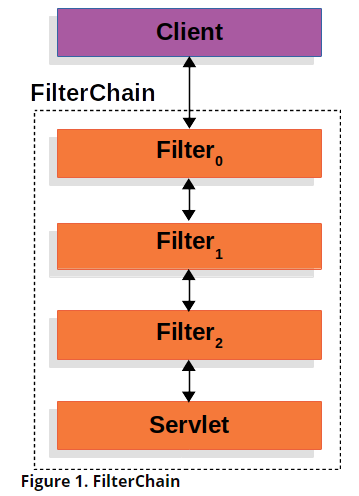
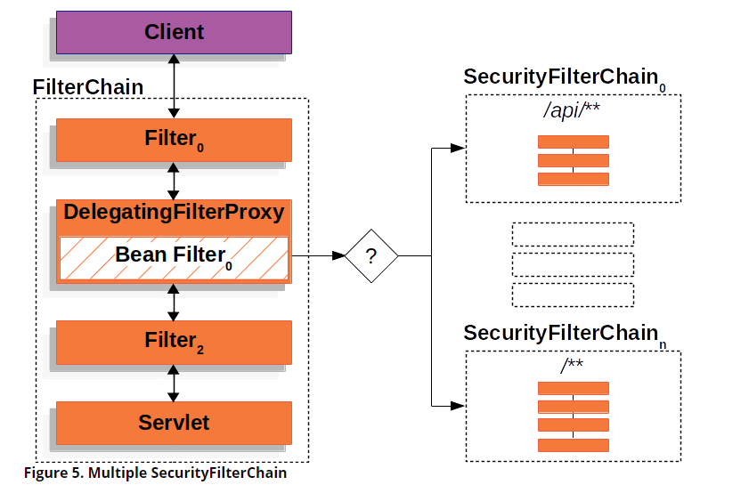
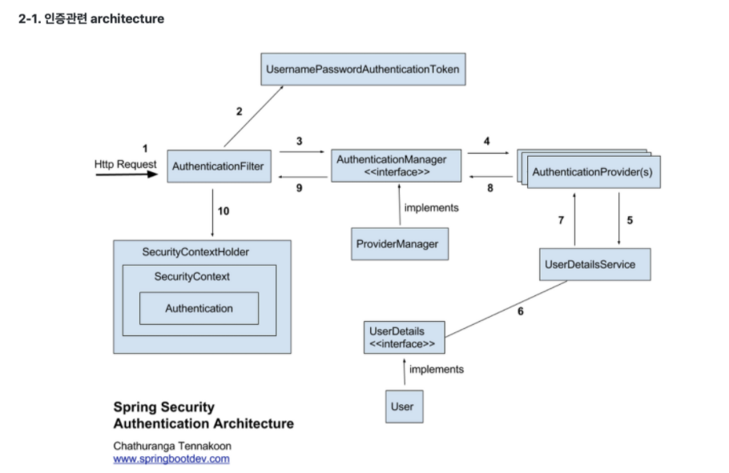

# Spring


자바 기반 엔터프라이즈 애플리케이션을 개발하는데 있어 유용하고 편리한 기능을 제공하는 프레임워크이다.

### 특징

- IoC 컨테이너라는것이 자바 객체의 생명주기를 직접 관리한다. IoC컨테이너가 객체의 의존성을 직접관리함으로써 개발자는 스프링으로부터 필요한 객체 의존성을 얻어온다.
- **IoC (Inversion of Control) 제어의 역전이라고 한다.** 보통 애플리케이션의 제어권은 개발자에게 있지만, 스프링은 제어권을 개발자에게 맡기는것이 아닌, 자신이 제어한다.
- **DI (Dependcy Injection)** 스프링이 직접 객체의 생명주기를 관리하고 필요한 객체들을 직접 주입해준다.
- **AOP (Aspect Oriented Programming)** 관점 지향 프로그래밍이라고 하여, 공통적으로 사용하는 부가 기능을 구분하여 사용한다. 이를 통해 재사용성을 높일 수 있다.
- **PSA 서비스 추상화란** 특정 로직을 위한 저수준의 모듈에 의존하지 않는다는것이다. 예를 들어 PlatformTransactionManager가 가장 대표적인 경우이다.
Database 접근기술은 굉장히 많으며 JDBC, Hibernate등이 존재한다. 이 모든것의 트랜잭션 코드가 다르기 때문에 만약 접근기술이 바뀐다면 그에대한 코드가 전부 변경될것이다. 
**스프링은 트랜잭션을 추상화시켜서 의존성을 역전했다.** 이후에 각 Database의 TransactionManager가 PlatformTransactionManger를 구현함으로써, 이를 해결한다.

## Spring Boot

SpringBoot는 Spring기반 Production 수준의 독립적으로 실행가능한 Application을 작성할 수 있도록 도와주는 프레임워크 이다.

### **Spring Boot Starter 의존성 제공**

기존에 스프링을 사용할때 버전을 명시하고 맞는 설정까지 하였지만 스프링 부트는 버전 관리를 스프링 부트에 의해서 관리된다. 그래서 개발자는 의존성을 추가할때 버전을 고려하지 않아도 된다.

[Spring Boot Reference Documentation](https://docs.spring.io/spring-boot/docs/current/reference/htmlsingle/#using-boot-dependency-management)

> Each release of Spring Boot provides a curated list of dependencies that it supports. In practice, you do not need to provide a version for any of these dependencies in your build configuration, as Spring Boot manages that for you. When you upgrade Spring Boot itself, these dependencies are upgraded as well in a consistent way.

### Auto-Configuration

Spring Boot는 개발자가 추가한 Jar 의존성을 기반으로 자동으로 애플리케이션을 설정을 구성하는 Auto-Configure을 지원한다. 

AutoConfiguration을 이용하고 싶다면, @EnableAutoConfiguration 또는 @SpringBootApplication 애너테이션을 @Configuration Class에 붙혀라.

### Embed Tomcat

내장형 톰캣을 가지고 있기 때문에 별도의 톰캣을 설정할 필요가 없으며, 독립적으로 실행가능한 Jar로 손쉽게 배포할 수 있다.

# Web Server vs Web Application Server

**Web Server**

소프트웨어적인 개념의 웹 서버는 클라이언트로부터 HTTP 요청을 받아들이고 처리한다. 이때 클라이언트에게 응답할 데이터가 정적 컨텐츠라면, 직접 응답할 수 있지만, 동적 컨텐츠인 경우 WAS에게 요청을 위임한다. 이후 WAS가 처리해준 응답을 클라이언트에게 반환한다.

**Web Application Server**

동적 컨텐츠를 제공하기 위해 만들어진 Application Server이다. JSP와 Servlet을 실행시킬 수 있기 때문에 이를 서블릿 컨테이너 혹은 컨테이너라고 부르기도 한다.

WAS는 웹 서버로부터 요청이 오면 web.xml을 참조하여 Servlet에 대한 Thread를 생성하고 HttpServletRequest와 HttpServletResponse객체를 생성하여 전달한다. 

이후 서블릿은 요청을 처리하고 동적 컨텐츠를 생성하여 컨테이너에게 전달한다.

컨테이너는 전달받은 Response객체를 웹서버에 전달하고 생성했던 쓰레드를 수거한다.

# Spring Security

스프링 스큐리티는 Spring 기반의 애플리케이션 보안을 담당하는 프레임워크이다. Spring Security는 인증과 권한에 대한 부분을 Filter의 흐름에 따라 처리한다. 

**인증(Authentication) :** 해당 사용자가 본인이 맞는지를 확인하는 절차

**인가(Authorization) :** 인증된 사용자가 요청한 자원에 접근 가능한지를 결정하는 절차

Servlet기반의 Spring Security는 Filter를 기반으로 구현된다. 보통 Filter는 Http Request를 순차적으로 Handling 방식을 제공하는데 아래 그림과 같은 구조이다.



Spring Security는 자체적으로 Filter의 인터페이스를 구현한 DelegatingFilterProxy라는것을 만들고 Servlet API에 등록시켜놓는다. DeleagatingFilterProxy는 Servlet Container와 Spring의 다리역할을 수행한다.  Filter는 Servlet 자체 표준이며, Bean이 아니지만 DelegatingFilterProxy를 통해 Spring Bean의 필터들에게 요청을 위임할 수 있다. 슈도코드로는 아래와 같다.

```jsx
public void doFilter(ServletRequest request, ServletResponse response, FilterChain chain) {
    // Lazily get Filter that was registered as a Spring Bean
    // For the example in DelegatingFilterProxy delegate is an instance of Bean Filter0
    Filter delegate = getFilterBean(someBeanName);
    // delegate work to the Spring Bean
    delegate.doFilter(request, response);
}
```

FilterChainProxy는 Spring Security가 제공하는 굉장히 특별한 Bean이다. 이 객체는 다수의 Filter 객체들로 구성된 SecurityFilterChain에게 요청을 위임하는 역할을 가지고 있다. 



SecurityFilterChain은 FilterChainProxy에 의해 사용되며, FilterChainProxy는 Spring Security의 필터들 중에 이번 요청에서 호출되어야 할 얘들을 선정한다. 

위의 그림에서 FilterChainProxy는 어떤 SecurityFilterChain이 쓰일지 결정하며, 단 조건에 맞는 단 한개의 SecurityFilterChain만 실행된다. 이것은 전적으로 Application에서 Security를 어떻게 Configure하냐에 따라 달라진다.

**스프링 Security Architecture**



SecurityContextHolder는 Spring Secuirty에서 인증된사람의 정보를 저장하는곳이다. 그사람이 어떻게 인증되었는지는 중요하지 않다. 만약 값을 가지고 있다면 그 사람은 인증된 사람이다.

**AuthenticationManager**는 Spring Security의 Filter가 어떻게 인증을 수행해야할지에 대한 정의를 담은 API이다. AuthenticationManager는 인증된 사용자에 대해 Authentication객체를 Filter에게 반환하고 이후 Filter는 SpringContextHolder에 Authentication 객체를 설정한다.

**ProviderManager**는 AuthenticationManager의 구현체이다. ProviderManager는 여러개의 AuthenticationProvider를 가지고 있으며 해당 Provider들은 각각 특정한 타입의 Authentication을 수행한다.

**AuthenticationProvider**는 ProivderManager에 의해서 관리되며, 각 AuthenticationProvider들은 특정한 타입의 인증을 수행한다. 예를들면 DaoAuthenticationProvider는 username/password 기반의 인증을 지원한다.