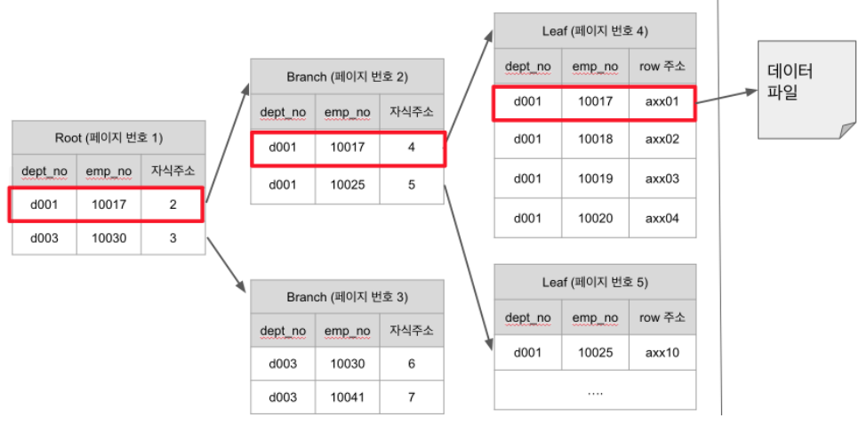
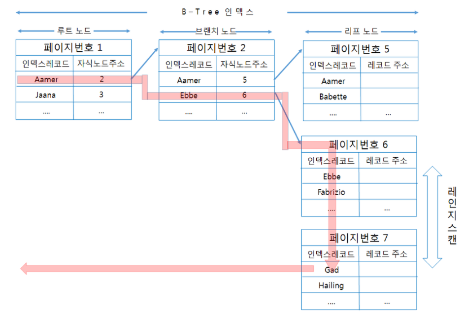

# 데이터베이스

Created: Mar 13, 2021 12:46 PM

# 인덱스란?

DBMS에서 인덱스를 말할때 항상 책의 찾아보기를 비유하곤 한다. 책에서 키워드에 해당하는 부분이 인덱스이고, 그에 해당하는 페이지 번호가 레코드의 주소, 그리고 책의 내용이 데이터 파일에 해당한다고 볼 수 있다.

인덱스의 또 다른 특성을 자료구조로써 설명하자면 ArrayList와 SortedList로 설명할 수 있다. 데이터 파일은 ArrayList처럼 저장된 순서대로 별도의 정렬없이 저장하며, 인덱스는 SortedList처럼 저장되는 값을 정렬하여 저장한다.

SortedList의 장점이라면 List가 정렬되어있기 때문에 굉장히 빠른속도로 데이터를 얻을 수 있다는 점이다. 

단점이라면 값을 삽입하고 삭제하고 변경하면 재정렬해야하므로 성능이 많이 느리다는 점이다.

**결론적으로 Index는 데이터의 저장 성능을 희생하고, 그 대신 데이터의 읽기 속도를 높이는 기능이다.**

데이터의 인덱스를 하나 더 추가하는것은 데이터의 저장속도를 어디까지 희생할 것인가? 와 읽기 속도를 얼마나 더 빠르게 만들어야하는지? 에대한 질문이라고 할 수 있다.

데이터 저장 방식(알고리즘)별로 분류하는것은 많은 분류가 존재하겠지만 대표적으로  B-Tree 인덱스와 Hash 인덱스가 존재한다.

# B-Tree 인덱스

B-Tree는 칼럼에 원래 값을 변형시키지 않고, 인덱스 구조체 내에서는 항상 정렬된 상태로 유지한다. 전문검색과 같은 특수한 요건이 아닌 경우, 대부분 인덱스는 거의 B-Tree를 이용할 정도로, 일반적인 상황에 적합하다.

B-Tree는 트리 구조의 최상위에 Root 노드가 존재하고 그 하위에 자식 노드들이 붙어있는 형태이다. 트리구조의 가장 하위에 있는 노드를 Leaf노드라 하고, 그 중간에 있는 모든 노드를 Branch 노드라고 한다. 

Leaf노드는 항상 실제 데이터 (레코드)를 찾아가기 위한 주소 값을 가지고 있다. 단 레코드의 주소는DBMS에 따라 물리적인 레코드 주소일 수 도 있고 내부적인 레코드 번호일 수 도 있으며 InnoDB 엔진 같은 경우 PK로 테이블을 클러스터링 하기 때문에 PK자체가 주소 역할을 할 수 있다.

### 인덱스 키 추가

새로운 인덱스 키 값이 B-Tree에 저장될 때 테이블의 스토리지 엔진에 따라 새로운 키값이 인덱스에 저장된다. B-Tree에 저장될때는 저장될 키 값을 이용해서 적절한 위치를 선택해야한다. 저장될 위치가 선택되면 B-Tree의 리프노드에 저장한다. 만약 리프노드가 꽉차있다면 분리되야 하는데, 이는 상위 브랜치 노드까지 범위가 넓어지기 때문에 B-Tree는 쓰기작업이 비용이 많이 든다.

### 인덱스 키 삭제

삭제하고자 하는 리프노드를 찾아 삭제마크만 하면 작업이 완료된다. 이후 이 인덱스 공간은 방치되거나 재활용된다.

### 인덱스 키 변경

인덱스 키 값은 그 값에 따라 저장될 리프노드의 위치가 결정되므로, 키 값을 쉽게 변경할 수 없다. 그래서 인덱스의 키 삭제 후 키를 다시 추가한다.

### 인덱스 키 검색

인덱스를 검색하는 작업은 B-Tree의 루트 노드부터 시작해 브랜치 노드를 거쳐, 최종 리프 노드까지 이동하면서 비교작업을 수행한다. 이과정을 "트리 탐색"이라고 한다.

B-Tree 인덱스를 이용한 검색은 100% 일치 또는 값의 일부분만 일치하는경우에만 사용할 수 있다. 부등호 연산 ("<>")은 사용불가능하다.

### 인덱스 레인지 스캔

인덱스 레인지 스캔은 인덱스 접근 방법 가운데 가장 대표적인 접근 방식으로, 레코드를 한건 또는 한건 이상을 읽는 경우를 표현한다. 인덱스 레인지스캔은 검색해야 할 인덱스의 범위가 결정되었을때 사용하는 방식이다

### 인덱스 풀 스캔

인덱스 풀 스캔은 인덱스를 처음부터 끝까지 전부다 읽는 방식이다. 인덱스 풀 스캔은 인덱스의 내용으로만으로도 쿼리를 처리할 수 있을때 사용되며, I/O가 줄어들기 때문에 좀 더 효율적으로 쿼리를 처리할 수 있다. 다만 이런식으로 인덱스를 사용하는 것이 옳은 방식은 아니다.

# Hash 인덱스

해시 인덱스는 B-Tree만큼 범용적이지는 않지만, 고유의 특성과 용도를 지닌 인덱스 가운데 하나다.

해시 인덱스는 동등 비교 검색에는 최적화 되어있지만, 범위를 검색한다거나 정렬된 결과를 가져오는 목적으로는 사용할 수 없다. 

일반적으로 Hash 인덱스는 메모리 기반의 테이블에 주로 구현돼있으며, 디스크 기반의 대용량 테이블용으로는 거의 사용되지 않는다.

해시 인덱스의 큰 장점은 실제 키 값과는 상관없이 인덱스의 크기가 작게 형성된다는 점이다. 
검색하고자 하는 값을 주면 해시함수를 거쳐서 찾고자 하는 키값이 포함된 버켓을 알아낼 수 있다. 그 버켓 하나만 읽어서 비교해보면 실제 레코드가 저장된 위치를 알 수 있다.

해시인덱스는 원래의 키값을 저장하는게 아니라, 해시함수의 결과를 저장하기 때문에 키 칼럼의 값이 상당히 줄어든다. 그래서 해시 인덱스는 B-Tree 인덱스보다는 상당히 크기가 작다.

# Transaction

데이터베이스에서 트랜잭션은 데이터베이스 상태를 변화시키는 하나의 논리적인 작업 셋을 수행하기 위해 한꺼번에 모두 수행되어야 할 일련의 연산들을 의미한다. 트랜잭션은 작업의 완전성을 보장한다. 즉 논리적인 작업 셋을 전부 완벽하게 처리하거나, 처리하지 못할 경우에 원 상태로 복구해서 작업의 일부만 적용되는 현상을 발생하지 않게 막아준다.

**트랜잭션의 성질**

1. **Atomicity(원자성)**

   트랜잭션의 연산은 데이터베이스에 모두 반영되든지 아니면 전혀 반영되지 않아야 한다.

2. **Consistency(일관성)**

   트랜잭션이 진행되는 동안에 데이터베이스가 변경되더라도 업데이트된 데이터베이스로 트랜잭션이 진행되는것이 아니라, 처음에 트랜잭션을 진행하기 위해 참조한 데이터베이스로 진행한다.

3. **Isolation(독립성, 격리성)**

   둘 이상의 Connection이 같은 Record에 접근하여 트랜잭션을 수행하는 경우, 어느 하나의 트랜잭션 실행중에 다른 트랜잭션의 연산이 끼어들 수 없다.
   또한 수행중인 트랜잭션이 완전히 종료될때 까지 다른 트랜잭션에서 수행 결과를 참조할 수 없다.

4. **Durability (영속성, 지속성)**

   성공적으로 완료된 트랜잭션의 결과는 시스템이 고장나더라도 영구적으로 반영되어야 한다.

**트랜잭션의 상태**

**활동(Active)** : 트랜잭션이 실행중인 상태

**실패(Failed)** : 트랜잭션 실행에 오류가 발생하여 중단된 상태

**철회(Aborted)** : 트랜잭션이 비정상 종료되어 Rollback 연산을 수행한 상태

**부분 완료 (Partially Committed)** : 트랜잭션의 마지막 연산까지 실행했지만,  Commit 연산이 실행되기 직전의 상태

**완료 (Committed)** : 트랜잭션이 성공적으로 종료되어 Commit 연산을 실행한 후의 상태

### 잠금

**글로벌 락**

MySQL에서 제공하는 Lock 중 가장 범위가 크다. 일단 한 세션에서 글로벌 락을 획득한다면, 다른 세션에서 SELECT를 제외한 대부분의 DDL 문장이나 DML 문장을 실행하는 경우 글로벌 락이 해제될때까지 해당 문장이 대기 상태로남는다. 또한 글로벌 락은 레코드 또는 테이블 심지어 데이터베이스가 달라도 MySQL 서버 전체에 영향을 미친다.

**테이블 락**

개별 테이블 단위로 설정되는 잠금이다. 명시적 또는 묵시적으로 테이블 Lock을 획득할 수 있으며 명시적으로 얻은경우 명시적으로 반납해야한다. 보통 묵시적인 테이블 락은 쿼리가 실행되는 동안 자동적으로 획득하였다가, 쿼리가 완료된 후 자동 해제된다.

InnoDB엔진같은 경우에는 쿼리의 실행에 테이블락을 사용하지 않고, 레코드 락을 사용한다. 하지만 테이블락도 이용하긴 하는데 그런때는 스키마를 변경하는 쿼리인 DDL의 경우에만 사용한다.

**유저 락**

문자열에 대해 Lock을 거는 잠금이다. 유저락은 자주 사용되지는 않지만 다수의 웹 서버가 어떤 정보를 동기화해야 하는 경우에 유저 락을 이용하면 쉽게 구현가능하다.

**네임 락**

데이터베이스 객체(테이블 또는 뷰)의 이름을 변경하는 경우 획득하는 잠금이다. 네임 락은 명시적으로 획득하거나 해제할 수 있는것이 아니라, RENAME TABLE을 이용하여 테이블의 이름을 변경하는 경우 자동으로 획득한다.

**레코드 락**

레코드 자체만을 잠그는 것을 레코드 락이라고 하며, InnoDB 엔진은 레코드 자체가 아니라 인덱스의 레코드를 잠근다.

### 트랜잭션 격리 수준

트랜잭션의 격리 수준이란 동시에 여러 트랜잭션이 처리될 때,  특정 트랜잭션이 다른 트랜잭션에서 변경되거나 조회하는 데이터를 볼 수 있도록 허용할지 말지를 결정하는것이다. 격리 수준은 4단계로 결정된다.

1. READ UNCOMMITTED
2. READ COMMITTED
3. REPEATABLE READ
4. SERIALIZABLE

1단계는 Dirty Read라고도 불리며 일반적인 데이터베이스에서는 거의 사용되지 않으며, 4단계 또한 동시성이 중요한 데이터베이스에서는 거의 사용되지 않는다. 4개의 격리 수준에서 뒤로 갈수록 각 트랜잭션 간의 데이터 격리 정도가 높아지며, 동시에 동시성이 떨어지는 것이 일반적이다.

MySQL 서버의 처리 성능이 뒤로가면 갈수록 많이 떨어질것이라고 생각하는데, 4단계가 아닌 이상은 많은 차이가 없다.

### READ UNCOMMITED

이 격리 수준에서는 각 트랜잭션에서의 변경 내용이 COMMIT이나 ROLLBACK 여부에 상관 없이 다른 트랜잭션에서 보여진다. 만약 다른 트랜잭션이 아직 완료되지않은 데이터를 조회하고, 이후에 트랜잭션이 ROLLBACK되어도, 여전히 다른 트랜잭션에서는 조회한 데이터를 정상이라고 생각하여 진행하게 된다.

이를 Dirty Read 현상이라고 하고, 이는 데이터 정합성에 문제가 많이 발생한다.

### READ COMMITTED

오라클 DBMS에서 기본적으로 사용하는 격리 수준이며, 이 레벨에서는 위와 같은 Dirty Read현상은 발생하지 않는다. 트랜잭션이 데이터를 변경했더라도, COMMIT이 완료된 데이터만 다른 트랜잭션에서 조회할 수 있기 때문이다.

만약 트랜잭션에서 데이터를 변경하면 COMMIT되기 이전에 UNDO영역에 이전의 데이터를 백업한다. 이후에 다른 트랜잭션에서 해당 데이터를 조회하면 UNDO영역의 백업된 데이터를 조회하게 된다.

이것은 NON REPEATABLE READ라는 부정합 문제가 있다. 이 문제란 같은 트랜잭션에서 조회한 데이터는 항상 같은 결과를 가져와야 한다는 REPEATABLE READ 정합성에 어긋나는 것이다.  예를들면 사용자 A가 데이터베이스를 수정하고 있을때 사용자 B가 조회하면 변경전 데이터이다. 이후 사용자 A가 트랜잭션을 완료하고 사용자 B가 다시 데이터를 읽으면 두개의 데이터가 서로 다른 불일치 현상이 발생한다.

**트랜잭션 내에서 실행되는 SELECT 문장과 트랜잭션 없이 실행되는 SELECT 문장의 차이가 무엇인가?**

READ COMMITTED 수준에서는 별 차이가 없다. 하지만 REPEATABLE READ 수준에서는 기본적으로 SELECT 쿼리 문장도 트랜잭션 범위 내에서 작동하는것이다. 이는 즉 트랜잭션을 시작하고 조회한 데이터는 계속 동일하다는것을 의미한다. (다른트랜잭션에서 데이터를 변경해도)

### REPEATABLE READ

이 격리 수준에서 모든 InnoDB 트랜잭션은 고유한 트랜잭션 번호(순차적으로 증가)를 가지며, UNDO 영역에 백업된 레코드에는 변경을 발생시킨 트랜잭션의 번호가 포함돼있다.

이후에 모든 SELECT 쿼리에 대해서 레코드는 자신보다 트랜잭션의 번호가 낮은 곳에서  변경한 것만 볼 수 있게 된다. 예를 들면 번호가 10인 트랜잭션은 데이터를 조회할 경우 번호가 11 이상인 트랜잭션이 수정한 데이터를 조회할 수 없다. 

**하지만 SELECT ... FOR UPDATE와 같은 쿼리는 부정합이 발생할 수 있다.**

UPDATE쿼리 같은 경우 레코드에 Lock을 걸어야 하는데 UNDO 레코드에는 락을 걸 수 없다. 그래서 이러한 쿼리는 언두 영역의 변경전 데이터를 가져오는것이 아니라 현재 레코드 값을 가져오게 된다. 이를 **PHANTOM READ**라고 한다.

### SERIALIZABLE

가장 단순한 격리 수준이지만, 동시에 가장 엄격한 격리 수준이다. 기본적으로 순수한 SELECT 쿼리와 같은 경우는 잠금을 설정하지 않고 실행되지만, SERIALIZABLE 격리 수준은 읽기 작업도 공유 잠금을 획득해야 한다. 동시에 다른 트랜잭션은 그러한 읽기작업이 수행중인 레코드를 변경할 수 없다. 그로인해 PHANTOM READ 현상이 발생하지 않는다.