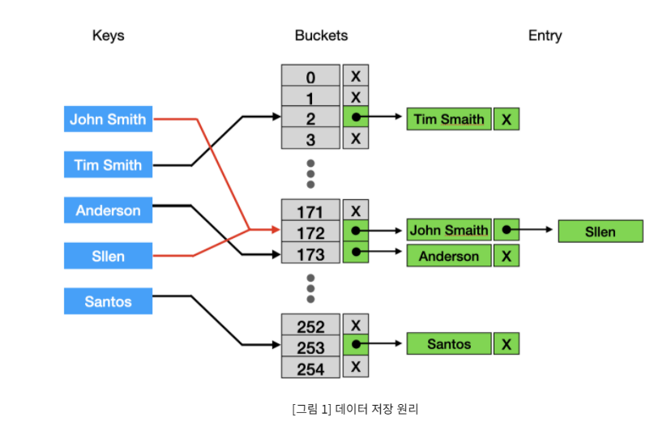

# 자료구조

Created: Mar 9, 2021 7:32 PM

# List

- ArrayList

사이즈를 조절할 수 있는 배열로써 List Interface의 구현체이다. 원소는 Object Type이여야 하며 심지어 null도 저장할 수 있다.

사용자가 ArrayList에 원소를 집어 넣을때, ArrayList는 배열의 크기를 조절할 수 있는 메서드를 제공한다. 

원소를 담을 배열의 크기가 부족해지면 더 큰 배열을 만들고 그곳에 모든 원소를 복사한다.

Vector와 ArrayList는 동기화를 제외한 모든 부분이 동일하다. ArrayList는 동기화를 제공하지않는 구현이다. 만약 멀티쓰레드에서 ArrayList에 동시적으로 접근하려면, 외부에서 동기화를 맞춰줘야한다.

```java
Collections.synchronizedList(List<T> list) //Synchronized List를 반환한다. Wrapper 메서드
```

외부에서 동기화를 맞춰주는 쉬운 방법은 위와 같은 코드를 작성해서, 내부적으로 Critical Section을 생성해주는 (어떻게 보면 프록시) 방법을 이용한다.

SynchronizedCollection은 mutex를 통해 동기화를 제공한다. 이때 mutex는 this이다.

- Vector

Vector 또한 사이즈를 조절할 수 있는 배열으로써 List의 구현체이다.  ArrayList와 거의 비슷하게 동작하지만 ArrayList는 동기화를 제공하지 않는 반면에 Vector는 동기화를 제공한다는 점이 다르다. Vector는 내부적으로 메서드에서 synchronized 를 선언하여 사용한다.

- Stack

자바에서 Stack 자료구조는 Vector를 상속받아서 구현된다. Stack은 Last In First Out (LIFO)구조를 따르기 때문에 Stack을 사용하면 push,empty,pop,peek 메서드만 사용할 수 있다.

- LinkedList

양방향으로 접근할 수 있는 Double Linked List로써, List와 Deque의 구현체이다. LinkedList도 ArrayList처럼, 동기화를 제공하지 않는다. 동기화를 사용하고싶다면 외부에서 동기화를 맞춰줘야 한다.

LinkedList는 탐색을 할때 명시된 인덱스에 따라 좀더 근접한 처음 또는 끝에서부터 탐색을 시작한다.

- Queue

자바에서 Queue의 구현체는 일반적으로 LinkedList를 많이 이용한다. 삽입과 삭제가 빠르기 때문이다. FIFO 구조이며, add,offer, remove, poll, peek 등의 메서드를 지원한다. 

- PriorityQueue

우선순위 큐의 내부는 최소힙 또는 최대힙으로 구성되있다. 최소힙이란 부모가 자식보다 작은 힙을 의미하고, 최대힙이란 부모가 자식보다 큰 힙을 의미한다.

우선순위 큐는 내부적으로 힙을 이용하며, 원소들의 순서를 결정할 수 있어야 한다. 일반적으로 자바에서 우선순위큐는 오름차순으로 정렬하거나 인자로 받은 Comparator을 통해 순서를 결정한다.

# Set

Set은 집합을 의미한다. 중복되는 원소를 허용하지 않으며, 이때 중복의 기준은 equals() 메서드에 해당한다. 그렇기 때문에 Object를 Set에 포함시키려는 경우 equals와 hashcode 메서드를 잘 오버라이딩 해야한다.

Set을 사용할때 주의할점은 내부 원소를 상태를 바꿔서는 안된다는것이다. 만약 내부 원소의 상태가 바뀌어서 equals()의 결과가 달라지면, 그 내부 동작은 예측할 수 없다.

Set.of 또는 Set.copyOf 메서드의 결과는 unmodifiable Set이다. 즉 변경할 수 없다. (List.of와 동일)

- **HashSet**

HashSet은 Set인터페이스의 구현체이다. Set은 원소에 대한 HashCode를 얻고 이를 이용해 HashCode % Size를 통해 Bucket에 저장한다. 

Bucket은 연결리스트로 구성되어있다. 그렇기 때문에 충돌이 생겨도 체인처럼 노드를 추가하여 데이터를 추가할 수 있다.

해시를 이용하여 O(1)만에 집합에 객체가 포함되어있는지 안되어있는지 판단할 수 있다. 하지만 HashCode가 이상하게 오버라이딩 된 경우 최악 O(N)의 시간복잡도를 가질 수 도 있다.

HashSet의 내부 구현은 HashMap으로 되어있다.



HashBucket의 크기가 작다면, 메모리는 아낄 수 있겠지만, 해시 코드 충돌로 인한 성능 손실이 발생할것이다. 이러한 이유로 저장된 갯수가 일정 갯수 이상이되면 버킷의 길이를 2배로 증가시킨다.

이때 버킷의 Size가 변경되었기 때문에 모든 원소가 저장되어야 할 버킷을 새로 설정한다. 

- **TreeSet**

TreeSet은 **이진탐색트리(Binary Search Tree) 정확히는 Red-Black Tree** 의 구조로 데이터를 저장하는 Collection이다. 

이진탐색트리 특성상 데이터를 넣고 삭제하는데 시간이 좀더 걸리고, 검색과 정렬에 유리한 자료구조이다.

TreeSet은 원소를 가지고 순서를 결정한다. 그렇기 때문에 Comparator 객체를 인자로 줄 수 있다. 내부 구현은 TreeMap으로 구성되어있다.

- **LinkedHashSet**

HashSet을 상속받기 때문에 기본적인 기능은 전부 동일하나, 내부에 Doubly-Linked List를 유지함으로써 입력된 자료의 순서를 보장한다. LinkedHashSet은 LinkedHashMap을 내부에서 사용한다.

### Map

Map 클래스는 Key와 Value를 Mapping해주는 클래스이다. 보통 다른 언어에서 Dictionary라고 불리기도 한다. Map은 중복된 키를 저장해서는 안된다. 한개의 키는 정확히 한개의 Value를 가르켜야 한다. 그렇기 때문에 Set의 내부구현에서 Map을 주로 사용하게 된다.

TreeMap같은 경우에는 원소들의 순서를 확실히 명시해줄 필요가 있다. 단 HashMap은 순서를 명시하지 않아도 된다.

- **HashMap**

HashMap은 Key Object를 HashCode로 변환하여, HashCode % BucketSize를 가지고, 테이블에 특정 인덱스에 저장한다. 이때 해시 충돌이 발생할 수 있기 때문에 버킷은 연결리스트를 가지고 있다.

- **TreeMap**

내부 구현이 **이진탐색트리, RedBlackTree** 로 구현되있는 TreeMap은 삽입과 삭제는 느리지만 검색과 정렬은 빠른성능을 보인다. 그렇기 때문에 TreeSet도 내부적으로 TreeMap을 이용한다.

TreeMap은 원소들의 순서를 보장해야한다.(Comparable or Comparator)

- **LinkedHashMap**

LinkedHashMap은 HashMap을 상속받고, 내부적으로 연결리스트를 이용하여 삽입 순서를 보장한다. LinkedHashSet에서 LinkedHashMap을 이용한다.

- **HashTable**

해시 테이블은 Key와 Value를 저장할 수 있는 일종의 Map이라고 생각할 수 있다. 또한 HashMap에서 제공하지 않는 동기화를 보장한다.

HashMap에서는 Null Key 또는 Null Value를 허용하지만, HashTable은 허용하지 않는다.